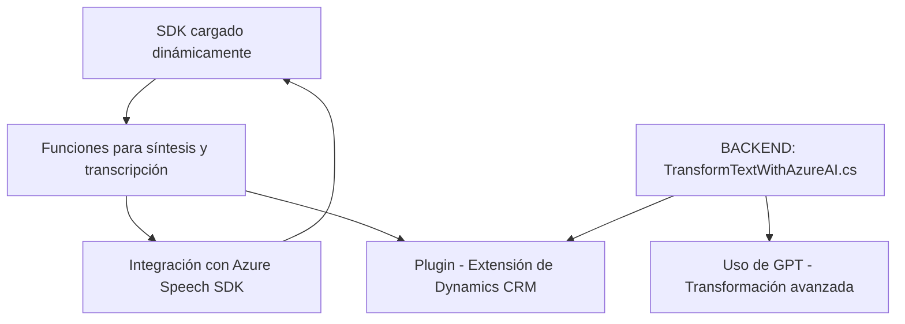

### Breve resumen técnico
El repositorio contiene archivos relacionados con la integración de reconocimiento de voz y transformación de texto mediante servicios de Azure (Azure Speech SDK y Azure OpenAI). La solución combinada permite la síntesis de voz desde formularios dinámicos en frontend, la transcripción de voz y la transformación de entrada de texto con IA en el backend. Parece estar orientada a funcionalidades dentro de una plataforma CRM como Microsoft Dynamics.

---

### Descripción de arquitectura
El sistema se divide en frontend y backend:
- **Frontend**: Implementa el reconocimiento de voz, interacción con formularios y generación de voz hablada. Usa un modelo procedural modular.
- **Backend**: Implementa plugins para Microsoft Dynamics CRM usando Azure OpenAI para transformación avanzada de texto.
- Arquitectura general: **Multicapa híbrida** con componentes que mezclan lógica procedural (frontend) y orientación a eventos en un monolito extendido (plugin backend).

---

### Tecnologías usadas
- **Frontend**:
  - Integraciones dinámicas del **Azure Speech SDK** para síntesis y transcripción de voz.
  - JavaScript archivos modularizados y estructurados.
  - Conceptos como eventos, callback, y mapeo de formularios dinámicos.

- **Backend**:
  - **C#** para extensiones de plugins compatibles con Microsoft Dynamics CRM.
  - **Microsoft Dynamics CRM SDK** (IPlugin, IOrganizationService).
  - **Azure OpenAI API** para transformación de texto (GPT).

- **Patrones generales**:
  - Modularidad funcional en frontend.
  - Carga dinámica para optimizar dependencias (ejemplo: Speech SDK).
  - Event-driven architecture en Microsoft Dynamics (backend).

---

### Diagrama Mermaid válido para GitHub

---

### Conclusión final
La solución es una integración robusta entre el procesamiento de voz (frontend) y la transformación de texto mediante IA (backend). Está diseñada para una plataforma CRM, como Microsoft Dynamics, permitiendo gestionar datos dinámicos mediante voz y texto. Aunque la arquitectura sigue un modelo híbrido, podríamos considerar mejorar su desacoplamiento integrando microservicios independientes para la gestión de voz e IA, optimizando la estructura.