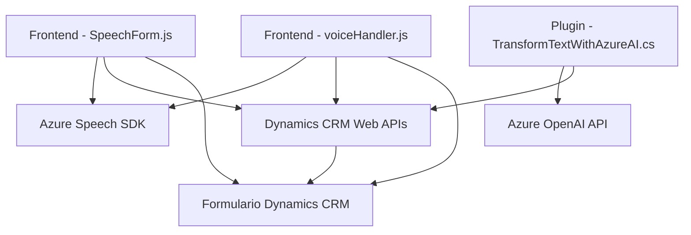

### Breve resumen técnico
El repositorio implementa una solución integrada para la entrada y salida de datos utilizando reconocimiento de voz, texto hablado y transformación text-to-speech, que interactúa directamente con formularios de Dynamics CRM. Este ecosistema emplea modulares como el **Azure Speech SDK** para el manejo de voz y el **Azure OpenAI API** para transformar texto estructurado mediante IA.

---

### Descripción de la arquitectura

La solución utiliza una arquitectura híbrida con tres componentes principales:
1. **Frontend (JavaScript)**: Manejo de eventos de entrada/salida con voz, interacción directa con formularios dinámicos y APIs internas de Dynamics como `Xrm.WebApi`.
2. **Backend Plugin (C#)**: Transformación de texto en un formato estructurado JSON que interactúa con la plataforma Dynamics CRM mediante lógica de negocio personalizada (plugins).
3. **Servicios externos**:
   - **Azure Speech SDK**: Reconocimiento de voz y síntesis de texto a voz.
   - **Azure OpenAI API**: Procesamiento avanzado de texto con el modelo GPT-4.

**Arquitectura predominante:**  
- **Event-Driven Architecture**: La solución responde de manera reactiva a eventos como el reconocimiento de voz o la entrada de texto en un formulario.
- **Hexagonal arquitectura orientada a servicios externos**: Al integrar servicios como Speech SDK y OpenAI API, junto con las APIs y plugins de Dynamics, la solución queda aislada y extendida, apostando por integraciones de servicios sin acoplamiento directo.

---

### Tecnologías usadas
- **Frontend (JavaScript)**:
  - Azure Speech SDK: Para reconocimiento de voz y síntesis text-to-speech.
  - DOM API: Manipulación de componentes en formulación web.
  - Microsoft Dynamics SDK (WebApi).
  - JavaScript moderno (ES6), Promesas y Callbacks.

- **Backend (C#)**:
  - Plugin SDK de Dynamics CRM: Implementando `IPlugin`.
  - Azure OpenAI API: Integración para procesamiento de texto basado en IA.
  - Newtonsoft.Json: Para manipulación de objetos JSON.
  - HttpClient: Singleton eficiente para consumo de REST APIs.

- **Servicios externos**:
  - Azure Speech SDK Integration.
  - Azure OpenAI API: GPT-4.
  - Microsoft Dynamics Web API para CRUD de entidades.

---

### Diagrama Mermaid

---

### Conclusión Final

Este repositorio implementa una solución integral para la interacción con formularios CRM basados en Dynamics, apoyándose en interfaces de voz y capacidades de IA avanzadas. El uso del **Azure Speech SDK** para reconocimiento de habla y síntesis de texto, combinado con la API de **Azure OpenAI** para transformación de contenidos, refuerza la orientación modular de los componentes.

La arquitectura es híbrida, inclinándose hacia el **Event-Driven Pattern** porque funciona mediante llamadas asincrónicas y eventos disparados por la interacción de usuarios con el sistema. La integración de servicios externos como críticos para la funcionalidad asegura escalabilidad y modularidad.