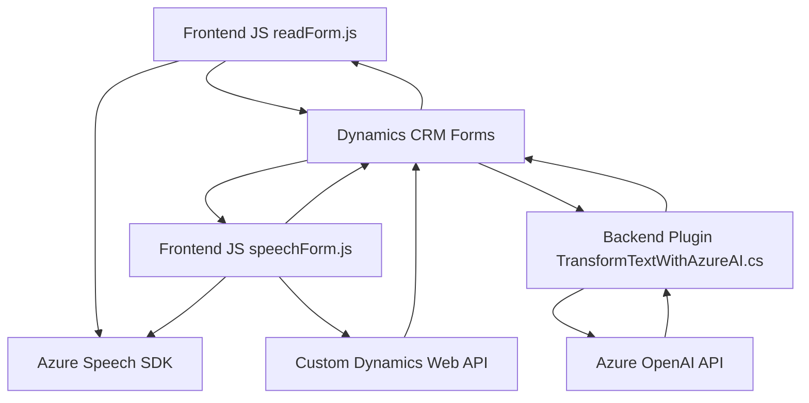

### Breve resumen técnico
La solución completa implementa funcionalidades accesibles mediante voz, reconocimiento de formularios dinámicos, y procesamiento de texto basado en inteligencia artificial (IA). Incluye:
1. **Frontend**: Scripts en JavaScript para manejar interacción de voz en formularios de Dynamics 365 mediante **Azure Speech SDK**.
2. **Plugins Backend en C#** para ejecutar integraciones con **Azure OpenAI**, transformando texto en JSON estructurado dentro de Microsoft Dynamics CRM.

### Descripción de arquitectura
- **Tipo de solución**: Es una solución orientada a sistemas corporativos, específica para **Microsoft Dynamics CRM** destinada a mejorar la accesibilidad y la entrada dinámica de datos. Combina un **frontend interactivo** con scripts para formularios y un **plugin backend** que aprovecha servicios de Azure.
- **Arquitectura**: 
  - **Frontend** basado en estructura de capas:
    - **Capa de Presentación**: Incluye scripts que interactúan directamente con la interfaz de formularios.
    - **Capa de Lógica de Negocios**: Procesa y transforma datos de formularios. 
    - **Integraciones externas**: Azure Speech SDK (para síntesis y reconocimiento de voz).
  - **Backend orientado a eventos**:
    - Sigue una **arquitectura de extensión típica de Dynamics CRM**, integrando un plugin que interactúa con Azure OpenAI para procesamiento remoto.
- **Patrones arquitectónicos**:
  - **Modularidad**: Funciones en el frontend, y métodos en el plugin, que separan responsabilidades.
  - **Desacoplamiento**: Integración con SDKs y APIs externas mediante patrones asíncronos.
  - **Orientación a eventos**: Backend basado en plugins para responder a acciones en Dynamics CRM.

### Tecnologías usadas
1. **Frontend**:
   - Lenguaje: JavaScript/ES6.
   - Frameworks: Azure Speech SDK cargado dinámicamente.
   - API de Microsoft Dynamics 365 (`Xrm.WebApi.online`).
2. **Backend Plugin**:
   - Lenguaje: C# (.NET Framework).
   - Json manipulación: `Newtonsoft.Json` y `System.Text.Json`.
   - APIs externas: Azure OpenAI.
   - Microsoft Dynamics CRM SDK: Extiende funcionalidades mediante `Microsoft.Xrm.Sdk`.

### Diagrama Mermaind
Diagrama que ilustra las interacciones de componentes entre frontend, backend, y servicios externos.

### Conclusión final
Esta solución combina funcionalidades de voz y IA con la integración de Microsoft Dynamics 365, adecuada para entornos corporativos que buscan mejorar la accesibilidad y la manipulación dinámica de datos. Presenta una arquitectura híbrida con capas en el frontend e integración directa de plugins backend en Dynamics CRM. Aunque técnicamente sólida, se podría mejorar en áreas como manejo seguro de las credenciales de API mediante KeyVault de Azure.