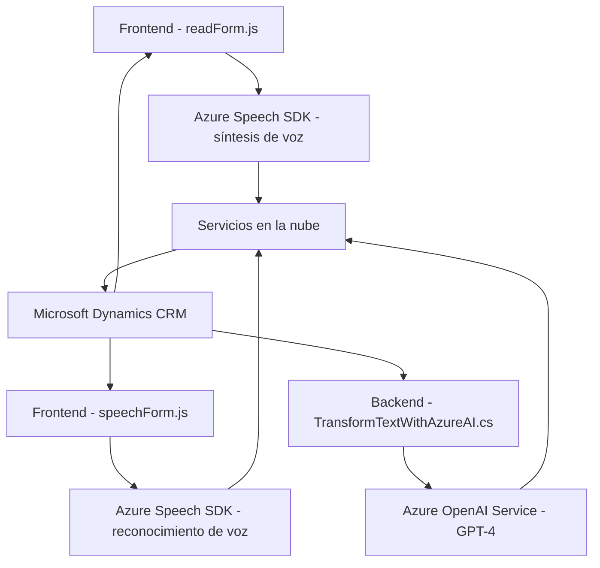

### Breve resumen técnico:
El repositorio contiene una solución híbrida que combina **frontend (JavaScript)**, **backend (plugin C#)** y servicios en la nube (Azure Speech SDK y Azure OpenAI). La funcionalidad está orientada a la integración de reconocimiento de voz y síntesis de voz con formularios, además de procesamiento avanzado de texto con inteligencia artificial. Los archivos están organizados en tres principales categorías: **frontend (JS)** para interactuar con el usuario, **backend (C# plugin)** para lógica extendida de procesamiento, y servicios de Azure para capacidades de IA.

---

### Descripción de arquitectura:
La arquitectura implementada en el repositorio es de tipo **n-capas**:
1. **Presentación (UI Layer):** Representada por los archivos `readForm.js` y `speechForm.js`, que manejan la interacción de usuario con los formularios y el reconocimiento de voz.
2. **Lógica de negocio (Business Layer):** Contenido en el archivo `TransformTextWithAzureAI.cs`, que implementa un plugin de Microsoft Dynamics CRM para transformar texto con reglas personalizadas mediante Azure OpenAI.
3. **Capa de servicios externos:** Utilización de Azure Speech SDK para síntesis y reconocimiento de voz, así como del servicio Azure OpenAI (GPT-4) para procesamiento avanzado de texto.
4. **Datos:** Aunque la capa de datos no está directamente explícita, se interactúa con entidades y datos de Microsoft Dynamics CRM para manipular formularios.

---

### Tecnologías usadas:
1. **Frontend:** JavaScript y la DOM API.
   - Azure Speech SDK para síntesis y reconocimiento de voz.
   - Microsoft Dynamics XRM JavaScript API para manipulación en el contexto del CRM.
2. **Backend:** C#.
   - Microsoft Dynamics SDK (`IPlugin`) para extender la funcionalidad nativa del CRM.
   - Azure OpenAI Service para procesamiento de texto avanzado.
   - NewtonSoft JSON para manejo de estructuras JSON.
3. **Servicios en la nube:**
   - Azure Speech SDK (síntesis y reconocimiento de voz).
   - Azure OpenAI Service (procesamiento de texto).
   
---

### Diagrama Mermaid válido para GitHub:

---

### Conclusión final:
Este sistema implementa una arquitectura de **n-capas** que combina interacción avanzada con formularios (frontend), procesamiento inteligente de texto (backend con Azure OpenAI), y reconocimiento/síntesis de voz (Azure Speech SDK). Los patrones de diseño son coherentes con los objetivos del sistema, priorizando modularidad y escalabilidad, además de una integración efectiva con servicios externos como Azure, para ampliar la funcionalidad básica de un CRM de Dynamics. La solución es ideal para sistemas dinámicos que requieren procesamiento contextual y capacidad de interacción mediante IA y voz, ofreciendo una excelente experiencia de usuario.