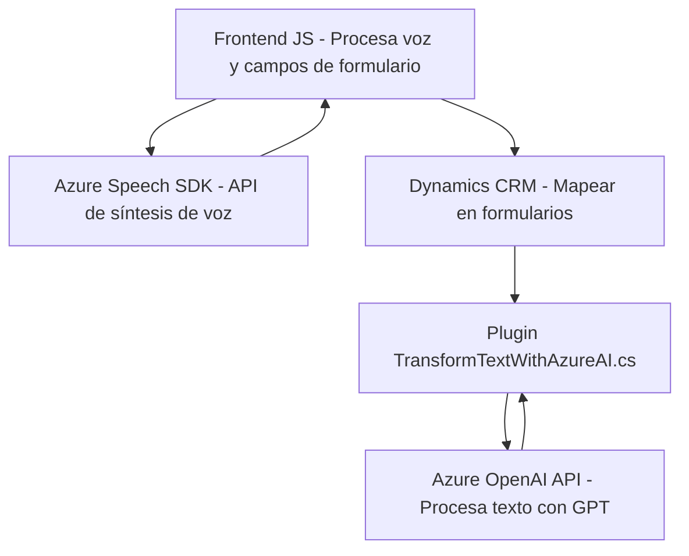

### Breve resumen técnico
Los archivos del repositorio corresponden a una solución que combina un frontend basado en tecnologías JavaScript y plugins para Dynamics 365 con servicios de Azure. La solución tiene dos principales objetivos:
1. Procesamiento de datos en formularios (lectura y mapeo).
2. Captura de voz y generación de texto JSON estructurado con integración de inteligencia artificial mediante Azure OpenAI.

### Descripción de arquitectura
La solución utiliza una arquitectura de **n capas** con integración cliente-servidor:
1. **Capa de presentación (Frontend):** Desarrollada en JavaScript, implementa lógica para capturar y procesar datos de formularios CRM y transcribir voz mediante el SDK de Azure Speech.
2. **Capa de negocio:** Incluye el plugin de Dynamics 365 (`TransformTextWithAzureAI.cs`), que actúa como middleware para transformar datos utilizando Azure OpenAI y reglas específicas.
3. **Capa de servicios:** Comunicaciones con APIs externas como Azure Speech y OpenAI constituyen la capa de servicios.

Se observa desacoplamiento entre el frontend y los servicios, con integración mediante SDKs y APIs REST.

### Tecnologías usadas
- **Frontend:**
  - JavaScript para el procesamiento cliente en navegadores.
  - Azure Speech SDK para transcripciones y síntesis de voz.
  - Dynamics CRM JavaScript Web API (`Xrm.WebApi`) para manipulación de datos del CRM.
- **Backend (Plugins en Dynamics 365 y APIs):**
  - .NET Framework con C# para plugins.
  - Azure OpenAI API para procesar texto con GPT.
  - HTTP Client para solicitudes REST.
  - JSON para estructuración y manipulación de datos.
- **Patrones:**
  - **Plugin Pattern:** Implementado en el plugin Dynamics 365.
  - **Facade Pattern:** Encapsulación de interacción con APIs externas.
  - **Modularidad:** Separación de lógica en funciones reutilizables.

### Posibles dependencias externas o componentes
- Azure Speech SDK (para procesamiento de voz).
- Azure OpenAI API (para manejo de texto con inteligencia artificial).
- Dynamics 365 con acceso a plugins y Xrm.WebApi.
- Servicios HTTP externos configurados en las APIs (por ejemplo, `https://aka.ms/csspeech/jsbrowserpackageraw`).

---

### Diagrama Mermaid válido para GitHub

---

### Conclusión final
La solución está diseñada para procesar datos a partir de formularios y entradas de voz, en un entorno de Dynamics 365, utilizando la potencia de los servicios en la nube de Azure (Speech SDK y OpenAI). La arquitectura empleada es de n capas, con desacoplamiento claro entre el frontend, la capa de negocio (plugin) y los servicios externos. Es modular, scalable y orientada a la integración inteligente con APIs de Azure, lo que facilita su uso en ecosistemas CRM modernos.