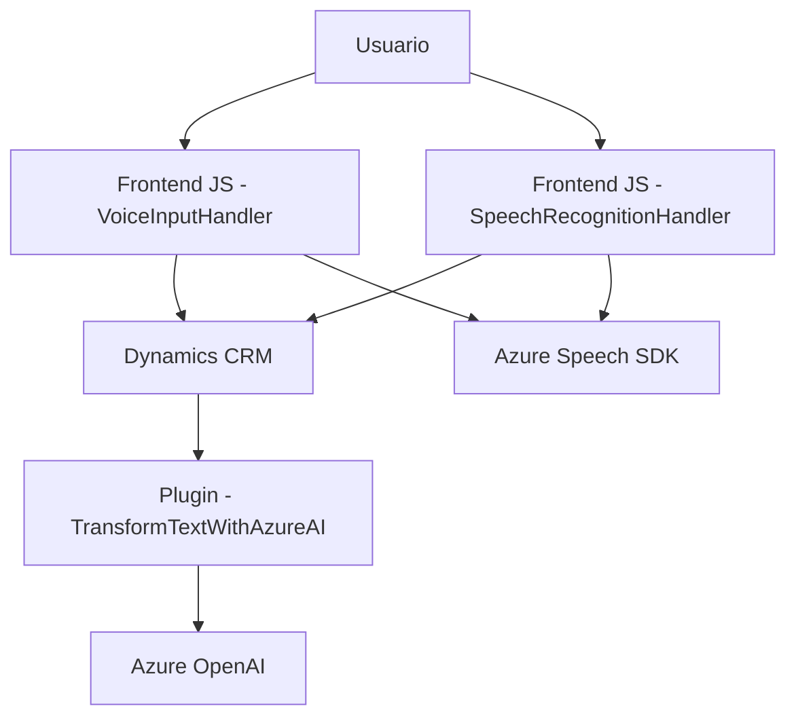

### Breve resumen técnico

El repositorio ofrece desarrollos destinados a integrar capacidades avanzadas de reconocimiento de voz, síntesis de voz y transformación de texto mediante tecnología Azure y Dynamics CRM. Se implementan funcionalidades para accesibilidad, como lectura y escritura mediante voz, y se incluye un plugin para la integración avanzada con Azure OpenAI, utilizado para transformar texto en JSON estructurado según normas específicas. 

### Descripción de arquitectura

La arquitectura general es híbrida:
- **Frontend**: Desarrollos JavaScript que interactúan con SDKs como Azure Speech SDK y el API de cliente de Dynamics (`Xrm`). Se utiliza una estructura modular basada en funciones.
- **Backend**: Plugin desarrollado en C# para Dynamics que opera como un servicio interno y se comunica con Azure OpenAI, siguiendo el patrón de extensibilidad de Dynamics CRM.

La solución sigue una arquitectura de **n capas**, donde cada capa cumple con roles específicos:
1. **Presentación (Frontend)**: Facilitación de entrada/salida de voz mediante SDKs.
2. **Lógica de negocio**: Plugins integrados en Dynamics CRM.
3. **Servicios externos**: Comunicación con Azure Speech SDK y Azure OpenAI mediante HTTP.

Esta arquitectura tiene características de integración de microservicios mediante APIs externas.

### Tecnologías usadas

1. **Frontend** (JavaScript):
   - **Azure Speech SDK**: Reconocimiento de voz y síntesis.
   - **API Dynamics CRM (`Xrm`)**: Para interacciones con formularios y datos.
   - **DOM Manipulation**: Uso de objetos como `document` y `window` para cargar recursos y obtener información del formulario.

2. **Backend** (C#):
   - **Microsoft Dynamics SDK**: Extensibilidad e interacción con datos de CRM.
   - **Azure OpenAI Service**: Procesamiento avanzado de texto en JSON mediante prompts.
   - **HTTP Client**: Comunicación con servicios Azure.
   - **JSON Handling (Newtonsoft.Json, System.Text.Json)**: Manejo y transformación de datos JSON.

3. **Servicios Externos**:
   - Azure Speech SDK: Entrada y salida de voz.
   - Azure OpenAI: Procesamiento avanzado de lenguaje (GPT).

### Diagrama Mermaid válido para GitHub

### Conclusión final

Este repositorio implementa una solución accesible y dinámica que integra tecnologías de voz y procesamiento de texto avanzadas, mejorando la interacción de usuarios con formularios en Dynamics CRM. La arquitectura emplea un enfoque modular, centrado en servicios externos (Azure Speech SDK, Azure OpenAI), lo que facilita la escalabilidad y la reutilización. Con un frontend modular y un backend basado en los patrones de Dynamics CRM, esta solución representa una aplicación robusta en el campo de la inteligencia artificial y el reconocimiento de voz.