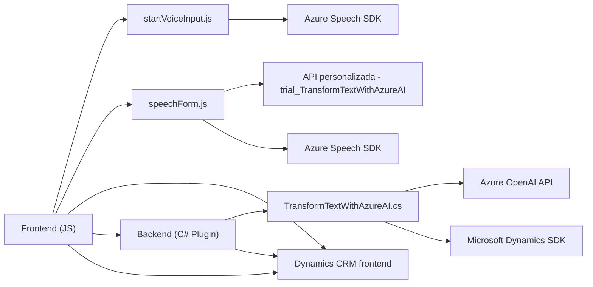

### Breve resumen técnico
El repositorio define una solución centrada en la **interfaz de usuario (frontend)** y una **lógica de backend orientada a servicios** para Microsoft Dynamics CRM y Azure. Consta de scripts JavaScript que implementan funcionalidad relacionada con voz y formulación dinámica, y un plugin C# que transforma texto usando Azure OpenAI API. El usuario interactúa con formularios en Dynamics 365, mientras la solución conecta con servicios externos como Azure Speech y Azure OpenAI.

---

### Descripción de arquitectura
La solución utiliza una arquitectura de **n-capas**, donde las capas principales son:
1. **Frontend (JS):** Gestiona las interacciones con Dynamics CRM y las manipula con funciones específicas relacionadas con voz y APIs externas.
2. **Backend (C# Plugin):** Extiende la funcionalidad de Dynamics CRM integrándose con servicios como Azure OpenAI para satisfacer tareas de transformación de texto.
3. **Servicios Externos:** Azure Speech API y Azure OpenAI API proporcionan la capacidad para síntesis de voz y procesamiento de texto AI.

La arquitectura también exhibe características de **Software orientado a servicios (SOA)**, con integración a través de servicios específicos y desacoplados.

---

### Tecnologías usadas
1. **Frontend:** JavaScript (navegador), integración con Dynamics CRM (XRM), carga dinámica del Azure Speech SDK.
2. **Backend:** C#, Microsoft Dynamics CRM Plugin, Microsoft.Xrm.Sdk.
3. **Servicios externos:**
   - Azure OpenAI API para procesamiento inteligente de texto.
   - Azure Speech SDK para reconocimiento y síntesis de voz.
4. **Otros:** Newtonsoft.Json, System.Text.Json para manejo JSON.

---

### Diagrama Mermaid (estructura simplificada)

---

### Conclusión final
La solución combina inteligentemente una interfaz dinámica de usuario, integración directa con APIs de alta utilidad (Azure Speech, OpenAI), y un plugin que extiende las capacidades del backend de Dynamics CRM. Esta arquitectura de **n-capas** y **orientada a servicios** favorece la escalabilidad y permite el fácil manejo de grandes cargas y cambios en las dependencias externas.

Aunque se utiliza una estructura común para soluciones de Dynamics CRM, los patrones de modularidad y desacoplamiento aumentan la sostenibilidad del sistema. Además, el uso de servicios de Azure permite implementar capacidades avanzadas como síntesis de voz y procesamiento AI sin requerir una infraestructura propia.