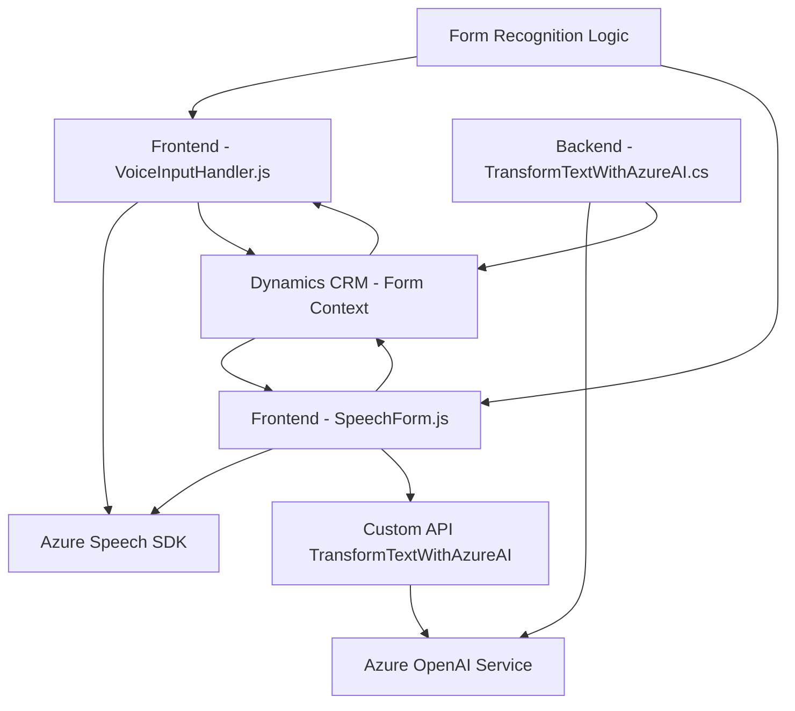

### Breve Resumen Técnico
El repositorio consta de archivos que implementan funcionalidades para integrar servicios de voz y transformación de texto utilizando Azure Cognitive Services y Dynamics CRM. Los módulos principales se enfocan en la lectura y síntesis de voz desde formularios, el reconocimiento de voz con mapeo de campos dinámicos, y la transformación de texto en el backend mediante el plugin de Dynamics 365 CRM.

---

### Descripción de la Arquitectura
La solución sigue un diseño modular y orientado a la integración con servicios externos. Los componentes principales son:
1. **Frontend (JavaScript)**: 
   - Encargado de la interacción del usuario y los formularios.
   - Implementa funcionalidades propias para la síntesis de voz y reconocimiento de voz utilizando Azure Speech SDK.
2. **Backend (Plugin en C#)**:
   - Diseñado para transformar texto empleando Azure OpenAI dentro del contexto de Dynamics CRM.
   - Expuesto como un plugin que se ejecuta en eventos configurados para entidades del CRM.

Predominantemente, la arquitectura sigue el patrón **n-capas**, donde cada capa tiene la responsabilidad de manejar un área específica:
- **Frontend UI Layer**: Gestiona la interacción de usuario.
- **Business Logic Layer**: Procesa datos reconocidos o transformados.
- **API Layer**: Realiza la comunicación con Dynamics CRM y servicios de Azure.

---

### Tecnologías Usadas
1. **Frontend**:
   - Azure Cognitive Services Speech SDK (texto a voz y reconocimiento de voz).
   - JavaScript ES6.
   - DOM Manipulation y APIs de navegador.
2. **Backend**:
   - Dynamics 365 Plugin Framework (`IPlugin`).
   - Azure OpenAI Service, utilizado para procesamiento avanzado de texto.
   - C# con SDK de Dynamics CRM.
   - Newtonsoft.Json y System.Text.Json para manipulación de estructuras JSON.
3. **Integración**:
   - Microsoft Dynamics CRM (formContext y Web API).
   - Azure Speech y OpenAI mediante REST APIs.

---

### Diagrama Mermaid Válido para GitHub

---

### Conclusión Final
La solución está claramente diseñada para el ecosistema de Microsoft Dynamics CRM, con una fuerte dependencia en servicios de Azure (Speech y OpenAI). Su arquitectura modular y desacoplada permite una flexibilidad única para ampliar funcionalidades del CRM, especialmente en el reconocimiento de voz, generación de texto y mapeo de campos dinámicos dentro de formularios. Es ideal para aplicaciones de negocio que buscan incrementar accesibilidad e incorporar IA para automatizar procesos de entrada de datos.