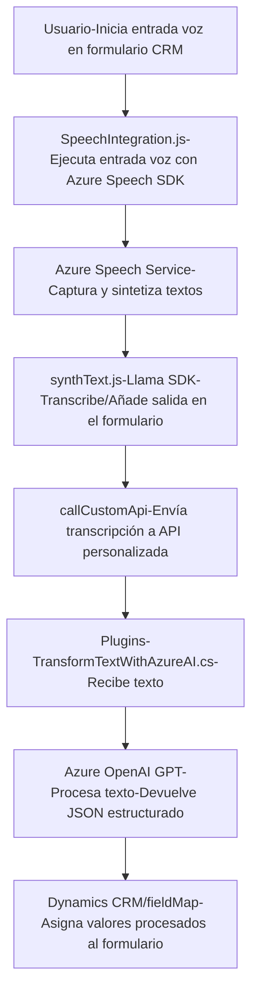

### Breve resumen técnico
El repositorio implementa una solución que combina tecnologías front-end y back-end, incluyendo el uso de servicios externos como **Azure Speech SDK** y **Azure OpenAI**. Forma parte de un sistema dirigido principalmente a integrar funcionalidades de procesamiento de formularios CRM con capacidades de inteligencia artificial, como síntesis de voz y procesamiento avanzado de entradas.

---

### Descripción de arquitectura
La estructura del código general indica un enfoque basado en **n capas**, donde:
1. **Frontend**: Implementa interfaces de usuario para interacción como la síntesis y el reconocimiento de voz. Se utilizan funciones modulares para manipular formularios y trabajar con servicios externos.
2. **Plugins y APIs**: Extensiones específicas integradas dentro del Dynamics CRM usando el **Plugin Pattern**, comunicándose con servicios cloud como Azure OpenAI para realizar transformaciones de texto.
3. **Servicios en la nube**: Usa Azure Speech SDK y Azure OpenAI API para funciones críticas como síntesis de voz, reconocimiento de voz y generación de texto estructurado por inteligencia artificial.
   
La arquitectura también aprovecha elementos de **Service-Oriented Architecture (SOA)**, integrando servicios externos para resolver tareas específicas, y patrones como el **Facade Pattern** para simplificar interacciones complejas con APIs.

---

### Tecnologías, frameworks y dependencias usadas
1. **Frontend (JavaScript):**
   - **Tecnologías:** Azure Speech SDK.
   - **Funciones del navegador:** Manipulación del DOM, llamadas HTTP dinámicas.
   - **Sistema CRM:** Dynamics 365 CRM para captura y asignación de valores en formularios.
   - **Patrones usados:** Modularidad de funciones, Wrapper SDK, integración de APIs externas, eventos/callbacks dinámicos.

2. **Back-End (C#):**
   - **Framework:** Dynamics CRM SDK.
   - **Dependencias externas:**
     - `Newtonsoft.Json` / `System.Text.Json`: Manejo de objetos JSON.
     - `System.Net.Http`: Realización de solicitudes HTTP.
   - **Servicios integrados:** Azure OpenAI API (interacción vía HTTP POST).
   - **Patrones usados**: Plugin Pattern, SOA, Facade Pattern.

---

### Diagrama Mermaid

---

### Conclusión final
El repositorio implementa una solución robusta basada en **n capas** orientada a mejorar la interacción entre formularios CRM y servicios de inteligencia artificial, con especial énfasis en la experiencia del usuario mediante voz. La funcionalidad del sistema se apoya en tecnologías de **Microsoft Azure**, integrando el **Speech SDK** para entrada/salida de voz y la **OpenAI API** para procesamiento textual avanzado. Esto permite combinar **procesamiento manual** y **automático** (por IA), ofreciendo una solución flexible y escalable para entornos empresariales como Dynamics CRM.

