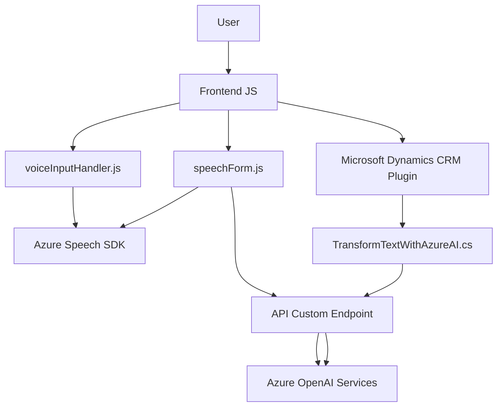

### Breve resumen técnico

La solución es un conjunto de archivos orientados al procesamiento de entrada/salida de voz y texto, que se integran con servicios de Azure (Speech SDK y OpenAI) en el contexto de una aplicación CRM como Microsoft Dynamics. Combina métodos frontend (manipulación de formularios y SDKs en JavaScript) con plugins backend desarrollados en C# para transformar y manipular datos.

---

### Descripción de arquitectura

La arquitectura sugerida por la estructura de este repositorio es **n capas**, con características específicas de modularización. Se observan las siguientes capas:
- **Presentación (Frontend JS):**
  Encargada de interactuar con usuarios y procesos en el navegador; maneja entrada/salida de voz y manipulación de formularios visibles.
  
- **Lógica de negocio (Backend y Plugins):**
  El plugin en C# se implementa como parte de un middleware entre Dynamics CRM y servicios de Azure para el procesamiento avanzado de datos (transformación asistida por IA).

- **Servicios externos (API de Azure):**
  Conectan la solución con Azure Speech Service para síntesis/reconocimiento de voz y Azure OpenAI para transformación de texto.

---

### Tecnologías usadas

1. **Fronted JS:**
   - **JavaScript:** Principal lenguaje para manipulación de formularios y comunicación con Azure Speech SDK.
   - **Azure Speech SDK:** Usado para la entrada/salida de voz, síntesis de voz y transcripción en español.
   - **Event-driven architecture:** Implementa eventos y callbacks para manejar la carga asincrónica del SDK.

2. **Plugins en C#:**
   - **C#/.NET:** Desarrollo del plugin que conecta con Dynamics CRM.
   - **Microsoft Dynamics CRM:** Contexto principal para manipulación de datos y atributos de formulario.
   - **Azure OpenAI API:** Implementa una integración directa para transformar texto usando IA.

3. **Patrones:** 
   - **N capas:** Contiene separación entre presentación, lógica de negocio y servicios externos.
   - **Fachadas:** Promueve encapsulación de llamadas externas (Azure Speech y OpenAI) dentro de métodos específicos, como `GetOpenAIResponse` y `speakText`.
   - **Modularidad:** Código organizado en módulos con funciones específicas, siguiendo el principio de responsabilidad única.

---

### Dependencias o componentes externos

1. **Azure Speech SDK:**
   Permite la síntesis de voz y transcripción. En el frontend, se carga mediante un script externo y usa servicios basados en claves API y regiones.
   
2. **Azure OpenAI API:**
   Endpoint personalizado para convertir texto según reglas específicas definidas por usuarios. Utiliza modelos como `gpt` y un método para la interacción directa con servicios de IA.

3. **Microsoft Dynamics CRM SDK:**
   El plugin en C# utiliza interfaces como `IPlugin` para integrarse con la plataforma de CRM y manipular atributos del formulario.

4. **Librerías de procesamiento:**
   - `Newtonsoft.Json` para serialización/deserialización de JSON.
   - `System.Net.Http` y `System.Text.Json` para realizar y manejar solicitudes API.

---

### Diagrama Mermaid

---

### Conclusión final

La solución presenta una arquitectura de **n capas** típica en sistemas CRM extendidos. Se destacan las capacidades de entrada/salida y procesamiento de voz en la capa de frontend mediante el uso de **Azure Speech SDK**. En el backend, los plugins desarrollados en **C#** están orientados a transformar y estructurar datos de formularios utilizando la **API de Azure OpenAI**. Los principales patrones empleados incluyen **event-driven architecture** en el frontend y **facade** para abstraer la interacción con APIs externas. Sin embargo, el manejo de secretos (como claves API) podría ser mejorado en ambas capas usando herramientas de gestión de secretos.