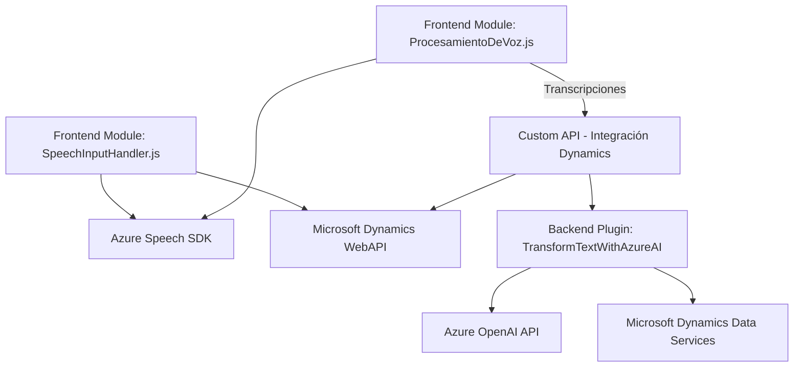

### Breve Resumen Técnico
El repositorio contiene tres componentes clave: 
1. Una integración **frontend** basada en reconocimiento y síntesis de voz usando **Azure Speech SDK**.
2. Funcionalidades de procesamiento de transcripciones con comandos de voz, asistido por IA para formularios en **Dynamics 365**, manejado desde el frontend.
3. Un plugin de CRM para llamar a **Azure OpenAI** con el fin de transformar textos, integrado como un microcomponente dentro de la arquitectura de **Microsoft Dynamics CRM**.

### Descripción de la Arquitectura
El sistema tiene una arquitectura **híbrida n-capas y basada en microintegraciones**, enfocada en uso de APIs externas (Azure Speech SDK, Azure OpenAI API). Cada capa cumple una función específica:
1. **Frontend (JS)**: Responsable del cliente visual y funcional para capturar/formatear datos, activando APIs y manejando eventos relacionados con el formulario en Dynamics 365. Trabaja como intermediario entre el usuario y el backend.
2. **Middleware Plugin (.NET)**: Reside en el backend de Dynamics CRM. Opera como un microservicio dedicado que aplica reglas de negocio específicas usando **Azure OpenAI**.
3. **Backend (Dynamics 365)**: Centraliza el manejo de datos de negocio utilizando `Microsoft.Xrm.Sdk` y otras dependencias del SDK para integrar con el sistema CRM.

### Tecnologías Usadas
1. **Frontend:**
   - **Azure Speech SDK**: Para conversión de reconocimiento de voz a texto y viceversa.
   - JavaScript: Desarrollo basado en funciones modulares para lectura y procesamiento de formularios.
   - Microsoft Dynamics WebAPI: Consultas y operaciones en tiempo real con el sistema backend.
2. **Backend Plugin:**
   - **Microsoft Dynamics SDK**: Integración en el ciclo de vida de los sistemas CRM.
   - **Azure OpenAI API**: Procesamiento inteligente de texto basado en GPT.
   - .NET Framework / C#: Desarrollo de microservicio/plugin.

### Dependencias o Componentes Externos
1. Azure Speech SDK: Integración desde un script externo para funciones de voz.
2. Azure OpenAI API: Respuesta JSON basada en GPT.
3. Dynamics 365 SDK (Xrm.WebApi): Interacción con la base de datos y servicios backend en Dynamics CRM.
4. Toolkits de serialización (Json, Newtonsoft.Json): Manejo de datos estructurados.

### Diagrama **Mermaid**

### Conclusión Final
La solución posee componentes de **frontend** y **backend**, estructurados para la interacción y procesamiento de datos basada en voz e inteligencia artificial. Usa una arquitectura de **n-capas**, donde ciertas partes (como el plugin en Dynamics y la API Azure OpenAI) funcionan como microservicios integrados. Esto combina un enfoque modular y escalable, ideal para soluciones CRM basadas en la automatización. La integración efectiva con APIs externas logra extender el procesamiento tradicional hacia funcionalidades más avanzadas como manejo de voz y procesamiento semiótico.