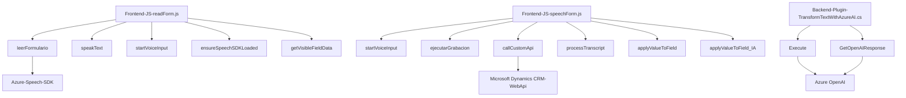

### Breve resumen técnico

El repositorio describe una solución basada en la interacción entre un frontend diseñado para formularios dinámicos y un backend en forma de plugin que utiliza servicios externos como Azure Speech SDK y Azure OpenAI. Esta solución integra voz y texto mediante APIs para mejorar la experiencia de usuario en Microsoft Dynamics CRM. Se utiliza la síntesis de voz, reconocimiento de voz y transformación de texto para permitir una interacción auditiva y automatizada con los datos del CRM.

---

### Descripción de arquitectura

**Tipo de arquitectura:**  
La solución sigue una arquitectura basada en sistemas distribuidos con módulos separados para frontend y backend. Los patrones principales que se aplican son:
- **Frontend modular:** Funciones en JavaScript separadas para lectura y síntesis de voz, reconocimiento de voz y procesamiento de formularios.
- **Backend extensible:** Uso de **IPlugin** en Dynamics CRM para implementar un plugin integrado con Azure OpenAI.

**Forma estructural:**  
1. **Capas funcionales:**  
   - Capa de Presentación (Javascript para interacción de voz y formularios).  
   - Capa de Negocio (C# plugin en Dynamics CRM).  
   - Capa de Integración con servicios externos (Azure Speech SDK y Azure OpenAI).  

2. **Arquitectura distribuida:**  
   - Integración con APIs externas para procesamiento de voz y texto.
   - Uso de llamadas HTTP y SDKs en tiempo de ejecución.  

---

### Tecnologías y patrones usados

1. **Tecnologías:**
   - **Frontend:**  
     - JavaScript ejecutado en Dynamics CRM (uso de APIs propias como `executionContext` y `formContext`).  
     - Azure Speech SDK para síntesis y reconocimiento de voz.  
   - **Backend:**  
     - C# para desarrollar el plugin basado en Dynamics CRM.
     - Azure OpenAI (IA basada en GPT-4) para transformación de texto.  
   
2. **Patrones de Diseño:**
   - **Callback Pattern:** Carga y utilización dinámica del Azure Speech SDK.  
   - **Modularidad:** Segmentación de funcionalidades JavaScript en métodos con una única responsabilidad.  
   - **Plugin Pattern:** Uso de interfaces (`IPlugin`) para extensibilidad en Dynamics CRM.  
   - **Promesas y asincronía:** Manejo eficiente de APIs y dependencias externas con promesas en JavaScript.  
   - **Dispatcher Pattern:** Delegación de tareas complejas al servicio de Azure OpenAI desde el plugin C#.  

---

### Dependencias y componentes externos

- **Servicios externos:**
  - **Azure Speech SDK:** Reconocimiento de voz y síntesis.  
  - **Azure OpenAI:** Procesamiento avanzado de texto con IA.  

- **Frameworks internos:**
  - **Dynamics CRM SDK:** Interfaces como `Xrm.WebApi` y capacidad de interacción con formularios (`executionContext`, `formContext`).  
  - **Microsoft.Xrm.Sdk:** Para la implementación del plugin en backend.  

---

### Diagrama Mermaid

---

### Conclusión final

La solución refleja una arquitectura distribuida centrada en la interacción avanzada entre usuarios y un sistema de CRM. Con un enfoque modular en el frontend y un plugin extensible en el backend, ofrece una integración fluida entre los formularios de Dynamics CRM y servicios externos como Azure Speech SDK y Azure OpenAI. La elección de patrones como modularidad y asincronía asegura una solución escalable y adaptable para entornos empresariales.