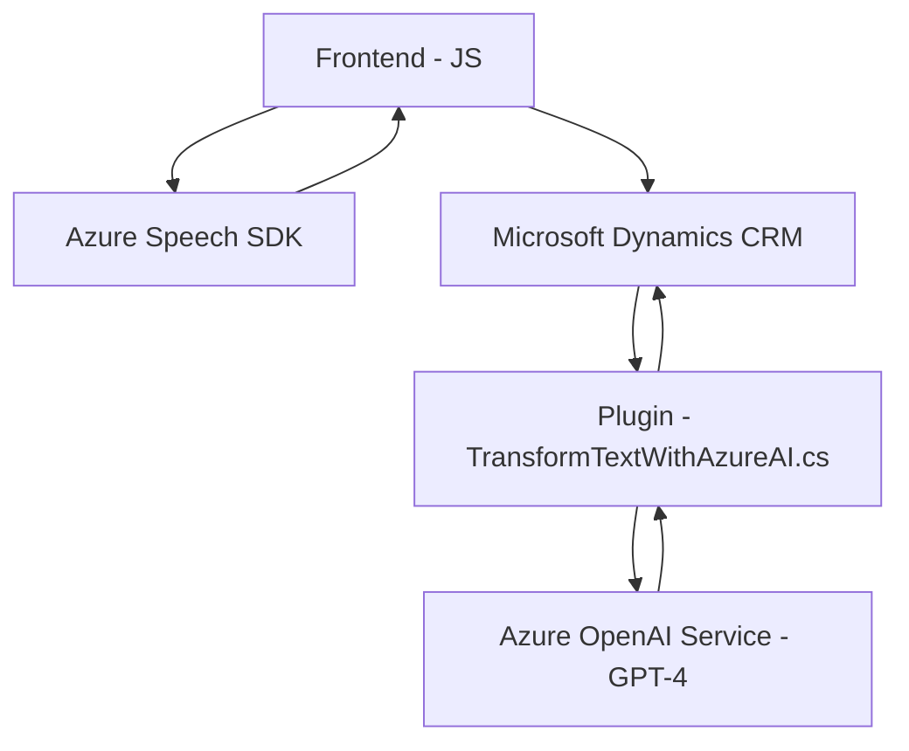

### Breve resumen técnico

El repositorio incluye tres archivos pertenecientes aparentemente a un sistema que integra **Microsoft Dynamics CRM** con **Azure Speech SDK** y **Azure OpenAI Service**. El sistema facilita el reconocimiento de voz y la interacción mediante audio con formularios en Dynamics, además de usar modelos de IA como GPT-4 para transformar datos en formato JSON estructurado y dinámico.

---

### Descripción de arquitectura

1. **Tipo de solución**:
   - Principalmente se trata de una solución orientada a la integración. Combina una **aplicación frontend Javascript** para interacción con usuarios, un **plugin en C# para Dynamics CRM**, y dependencias de Azure para Speech SDK y OpenAI Service. Podría considerarse una aplicación API-service con una lógica de negocio distribuida.

2. **Patrones usados**:
   - **Facade**: Los archivos JavaScript encapsulan funciones específicas para manejar la interacción de formularios y voz, simplificando la integración con SDKs y APIs externas.
   - **Plugin Pattern**: El archivo `TransformTextWithAzureAI.cs` sigue la arquitectura estándar de desarrollo de plugins en Dynamics CRM.
   - **Event-Driven Architecture**: El SDK de Azure Speech se basa en eventos para el reconocimiento de voz en tiempo real.
   - **Integration Pattern**: Se conecta con servicios externos como OpenAI y Azure SDK mediante acceso a APIs REST.
   - **Single Responsibility Principle**: Cada archivo tiene responsabilidades bien definidas (lectura del formulario, síntesis de voz, transformación de texto, etc.).

3. **Arquitectura global**:
   - La solución emplea una arquitectura **n-capas** en la que los componentes frontend (JS) interactúan con la lógica empresarial en Dynamics CRM mediante capas de plugins y conectores REST al backend de servicios externos. No es una arquitectura de microservicios.

---

### Tecnologías usadas

- **Frontend**:
  - Javascript: Permite la ejecución de funcionalidades relacionadas con la lectura del formulario y conexión con SDKs.
  - Azure Speech SDK: Para reconocimiento y síntesis de voz.
  - Integración directa con Microsoft Dynamics CRM (`executionContext`, `Xrm.WebApi`).

- **Backend/Plugin**:
  - Lenguaje C#: Siguiendo el marco de desarrollo de plugins de Dynamics CRM.
  - Azure OpenAI Service + GPT-4: Usado para transformar texto mediante IA.
  - Ecosistema de Dynamics CRM: `Microsoft.Xrm.Sdk`.

- **APIs externas**:
  - REST API de Azure OpenAI para procesamiento avanzado de datos.
  - Dynamics CRM API para interacción con datos internos.

---

### Dependencias o componentes externos

1. **SDKs**:
   - Azure Speech SDK (para entrada/salida de voz).
   - Dynamics CRM API.

2. **APIs externas**:
   - Azure OpenAI Service (GPT-4): Cómputo basado en IA para transformación de texto.
   - Dynamics CRM Web API: Procesamiento de datos en conjunto con formularios de CRM.

3. **Bibliotecas internas**:
   - **Newtonsoft.Json**: Para manejar JSON estructurado en el plugin C#.
   - **Microsoft.Xrm.Sdk**: Base para operar dentro del contexto de Dynamics CRM.

4. **Configuraciones sensibles**:
   - Uso de `api-key` y endpoints directamente en código podría requerir una refactorización para mayor seguridad.

---

### Diagrama Mermaid válido para GitHub

### Conclusión final

La solución presenta una arquitectura **n-capas**, donde frontend, plugins backend, y servicios externos colaboran para integrar capacidades avanzadas como reconocimiento de voz, síntesis auditiva y procesamiento de texto mediante IA. Está diseñada para mejorar la accesibilidad y funcionalidad en entornos de CRM, como Microsoft Dynamics. Su implementación usa patrones que facilitan la modularidad y la integración, aunque sería ideal optimizar la gestión de configuraciones sensibles codificadas directamente en el sistema.