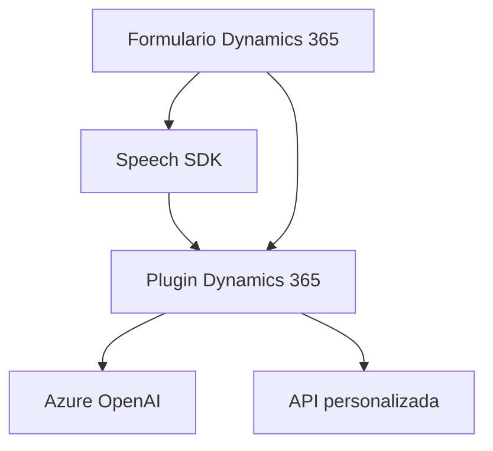

### Análisis técnico del repositorio

#### Breve resumen técnico
El repositorio contiene componentes que integran el reconocimiento de voz, síntesis de texto en voz y procesamiento avanzado de texto mediante Azure SDK y Dynamics 365. Hay archivos específicos para el frontend (manejo de formularios y eventos en JavaScript), procesamiento por **plugins** en Dynamics CRM y servicios externos en Azure (nube). La solución tiene tres capas principales: frontend para interacción con usuarios, backend en Dynamics para manipulación de datos, y servicios externos en Azure (IA y voz).

---

#### Descripción de arquitectura
La arquitectura utilizada parece corresponder a una **n-capas** con integración de servicios. Las capas definidas son:
1. **Frontend**: Carga y procesamiento de datos en la interfaz del usuario, donde se utilizan formularios de Dynamics 365 y servicios de voz como Azure Speech SDK.
2. **Backend (Plugins)**: Plugins para Dynamics CRM, orientados a la transformación y procesamiento de datos estructurados enviados al sistema.
3. **Servicios externos**: Integración con herramientas como Azure Speech SDK y OpenAI para realizar funciones avanzadas de reconocimiento, síntesis y análisis.

Ciertos patrones específicos destacan:
- Modularidad: Las funcionalidades están distribuidas en archivos y funciones aisladas.
- Event-driven Design: Uso de promesas y callbacks en el frontend para actividades asincrónicas.
- Cliente-servidor: Comunicación bidireccional entre cliente (formulario) y servicios externos.
- Adaptadores: Transformación de datos desde entrada reconocida por voz hacia estructuras del formulario o JSON.

---

#### Tecnologías usadas
- **Frontend**:
  - **JavaScript**: Manipulación de DOM, eventos y llamadas a APIs externas.
  - **Azure Speech SDK**: Manejo de reconocimiento y síntesis de voz.
  - **Dynamics 365**: Interfaz y mapeo de datos en formularios para CRM.

- **Backend (Plugins)**:
  - **C# (.NET)**: Desarrollo del plugin y procesamiento de texto.
  - **Microsoft Dynamics SDK**: Integración y manejo contextual de Dynamics CRM.
  - **Azure OpenAI**: Transformación de texto con aprendizaje automático.

- **Servicios externos**:
  - Azure Speech SDK y OpenAI.
  - APIs HTTP personalizadas.

---

#### Dependencias o componentes externos presentes
1. **Azure Speech SDK**: Utilizado para reconocimiento y síntesis de voz.
2. **Dynamics 365 SDK**: Manipulación y mapeo de datos en formularios CRM.
3. **Azure OpenAI API**: Procesamiento avanzado de texto para generar respuestas estructuradas (JSON).
4. **APIs personalizadas**: Método `callCustomApi` indica que existe una API externa específica para este proyecto.

---

#### Diagrama Mermaid válido para GitHub Markdown

---

#### Conclusión final
El repositorio describe una solución de **n-capas** orientada al reconocimiento de voz y procesamiento de datos en formularios de Dynamics 365, haciendo uso extensivo de servicios en la nube como Azure Speech y OpenAI. Las tecnologías están bien segregadas por responsabilidades, y la arquitectura es modular y adecuada para proyectos de integración con herramientas de CRM y servicios cognitivos.