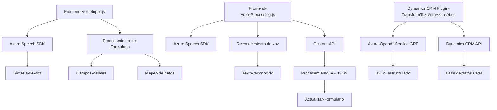

### Breve Resumen Técnico
El repositorio contiene tres archivos principales: 
1. **VoiceInput.js**: Procesa la entrada y salida de voz para comunicar con el usuario mediante Azure Speech SDK utilizando comandos por voz.
2. **VoiceProcessing.js**: Traduce comandos de voz a texto y aplica valores en un formulario interactuando con Dynamics CRM y APIs personalizadas.
3. **TransformTextWithAzureAI.cs**: Plugin de Dynamics CRM que utiliza Azure OpenAI Service para transformar texto de entrada en un JSON estructurado, siguiendo reglas predefinidas.

La solución tiene una estructura modular que conecta frontend (VoiceInput.js y VoiceProcessing.js) y backend (plugin para Dynamics CRM).

---

### Descripción de Arquitectura
La solución es una **microservicios**-API con una **arquitectura de integración externa** que aprovecha servicios como Azure Speech SDK y Azure OpenAI para funcionalidad avanzada. Las secciones están claramente divididas: procesamiento en el navegador (frontend), generación de síntesis por voz, integración dinámica con formularios y procesamiento externo por API en el backend (Dynamics CRM).

---

### Tecnologías Usadas
1. **Frontend**: 
   - **Azure Speech SDK** para reconocimiento y síntesis de voz.
   - **JavaScript ES6**: utilizado para la implementación de lógica del cliente.
   - **Dynamics CRM SDK (Xrm.WebApi)**.
   
2. **Backend**:
   - **Microsoft Dynamics CRM plugin (IPlugin)**: permite reglas personalizadas en eventos y datos de la plataforma.
   - **Azure OpenAI Service**: usando modelos GPT para el procesamiento avanzado de lenguaje.
   - Frameworks como:
     - **Newtonsoft.Json** y **System.Text.Json** para manejar datos JSON.
     - **System.Net.Http** y **HttpClient** para realizar comunicación REST con Azure OpenAI.
     
3. **Infraestructura**:
   - Servicios en la nube como **Azure Speech** y **Azure OpenAI**, configurados mediante claves API y regiones específicas.

4. **Patrones de Arquitectura**:
   - **Modularidad**: Dividir la lógica en funciones pequeñas y dedicadas.
   - **Uso de SDK/API externas**: para servicios como voz y procesamiento de texto.
   - **Callback pattern**: Para gestionar eventos y procesos asíncronos.
   - **MVC-like**: El frontend organiza lógica y datos desde los modelos dinámicos en el formulario hacia las APIs externas.

---

### Diagrama Mermaid compatible con GitHub Markdown

---

### Conclusión Final
La solución muestra una arquitectura moderna de **microservicios** y **integración externa basada en API/SDK**, ideal para aprovechar capacidades avanzadas como síntesis y reconocimiento de voz, además del uso de AI con Azure OpenAI. Está bien separada en procesos frontend y backend, cada uno con tareas específicas. Sin embargo, para mejorar su calidad, sería conveniente implementar pruebas automatizadas, optimizaciones de manejo de errores, y documentación estructurada sobre su deployment en plataformas como Azure o Dynamics CRM para facilitar su mantenimiento y escalabilidad.