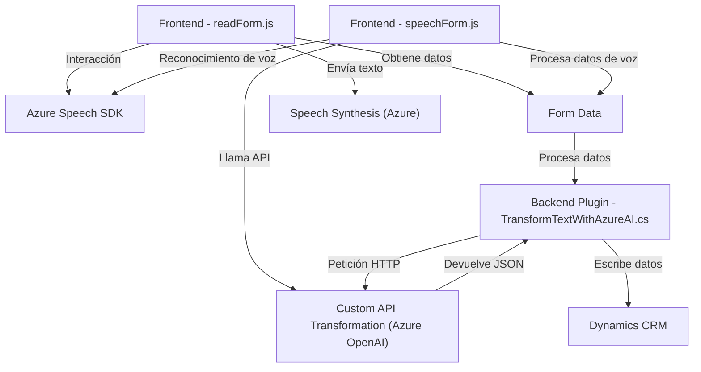

### Breve resumen técnico

El repositorio contiene archivos para implementar una solución compuesta por un sistema frontend (2 archivos JavaScript) y un plugin de Dynamics CRM desarrollado en C#. La solución se integra con los servicios de **Azure Speech SDK** para síntesis y reconocimiento de voz, así como con **Azure OpenAI** para transformar texto utilizando inteligencia artificial. Los archivos están diseñados bajo principios de modularidad, responsabilidades únicas y utilizando arquitecturas orientadas a API y componentes externos. La funcionalidad principal conecta un sistema de formularios con el reconocimiento y síntesis de voz, y los transforma mediante reglas dinámicas configuradas por el usuario.

---

### Descripción de arquitectura

La arquitectura presenta una solución **orientada a servicios**, donde cada módulo tiene una responsabilidad específica:

1. **Frontend (Microfrontend)**:  
   Implementado en JavaScript, organiza el código bajo una estructura modular con funciones de interacción directa con las APIs de Azure Speech SDK, reconocimiento de voz, síntesis de texto y mapeo de datos hacia elementos del formulario.
   
2. **Backend (Plugin)**:  
   La lógica del servicio backend está implementada en C# como un plugin para Dynamics CRM. Este se encarga de extender la funcionalidad del CRM, invocar la API de Azure OpenAI y realizar procesos de transformación de texto con reglas predefinidas.

Este tipo de arquitectura utiliza componentes desacoplados, donde el frontend maneja las interacciones de interfaz y el backend realiza operaciones con servicios externos y API REST. Basándonos en estas características, la solución sigue el patrón arquitectónico de **SOA (Service-Oriented Architecture)** con enfoque hacia servicios distribuidos y componentes modulares que utilizan dependencias externas.

---

### Tecnologías usadas

**Frontend:**
1. **JavaScript**: Lenguaje utilizado en los archivos del módulo frontend.
2. **Azure Speech SDK**: Ofrece funcionalidades de síntesis y reconocimiento de voz.
3. **Dynamics CRM APIs**: Para manejos de los formularios y atributos en el frontend.

**Backend:**
1. **C#**: Lenguaje usado en el desarrollo backend.
2. **Azure OpenAI API**: Servicio para transformar texto mediante inteligencia artificial.
3. **Microsoft.XRM.SDK**: Biblioteca estándar de integración para los plugins de Dynamics CRM.
4. **System.Net.Http**: Usada para realizar comunicación HTTP con APIs (Azure OpenAI).

---

### Dependencias o componentes externos

1. **Azure Speech SDK**:  
   Este servicio permite realizar síntesis y reconocimiento de voz para interactuar con datos del formulario (en los archivos JavaScript). Es una dependencia crítica.  

2. **Azure OpenAI API**:  
   Utilizada en el plugin C# para transformar texto basado en modelos GPT avanzados. Se requiere una clave de suscripción y configuración del endpoint para el acceso correcto.  

3. **Dynamics CRM Web APIs**:  
   Los archivos JS interactúan directamente con formularios del CRM usando `WebResource` y `Xrm.WebApi` para los procesos relacionados con atributos.  

4. **Bibliotecas de C#**:  
   - `Newtonsoft.Json.Linq`: Procesar JSON dinámico.
   - `System.Text.RegularExpressions`: Manipulación de cadenas usando expresiones regulares.
   - `System.Net.Http` y `System.Text.Json`: Para solicitudes HTTP y operaciones con JSON.

5. **Metadatos de los formularios del CRM**: El frontend depende de la estructura de los formularios en el CRM para el mapeo dinámico de campos y valores.

---

### Diagrama Mermaid

---

### Conclusión final

Este repositorio contiene una solución que trabaja bajo el patrón **SOA** (Service Oriented Architecture) al integrarse con servicios externos como **Azure Speech SDK** y **Azure OpenAI API**. La modularidad de los archivos evidencia la separación de responsabilidades entre frontend (input/output de voz, manipulación del DOM, integración con datos de formularios) y backend (transformación de datos del formulario usando inteligencia artificial gestionada por el plugin de Dynamics CRM). 

La estructura es eficiente en manejar datos entre un sistema de formularios interactivo y servicios basados en la nube, haciendo uso de arquitecturas modernas, APIs externas y la capacidad de orquestar servicios distribuidos.