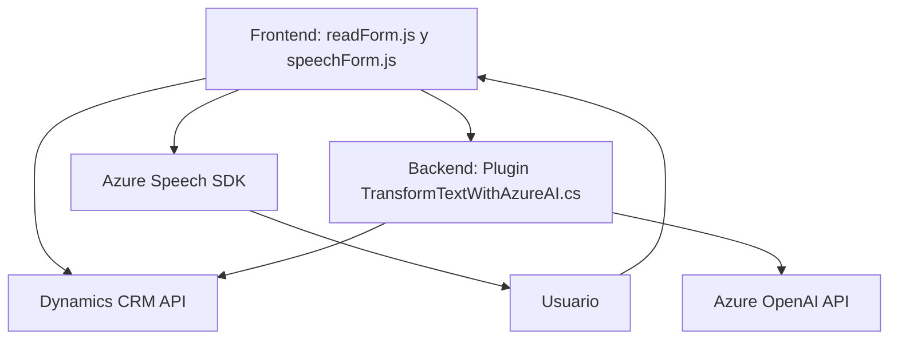

### Breve resumen técnico
El repositorio contiene tres archivos clave: `readForm.js` y `speechForm.js` en el frontend y un plugin de Dynamics CRM (`TransformTextWithAzureAI.cs`), todos enfocados en la interacción entre usuarios, formularios CRM y capacidades de inteligencia artificial y voz proporcionadas por Azure. La solución combina captura de voz, síntesis de texto a voz y transformación de datos mediante procesamiento AI.

---

### Descripción de arquitectura
1. **Tipo de solución**: Es una solución híbrida formada por un frontend basado en interacción dinámica con formularios CRM y un backend que opera como extensión plugin de Dynamics CRM. Los archivos están configurados para:
   - Captura y síntesis de voz en JavaScript mediante Azure Speech SDK.
   - Transformación de texto en el backend con Azure OpenAI API.

2. **Tipo de arquitectura**: La solución utiliza una arquitectura desacoplada con tres capas principales:
   - **Capa de presentación (frontend)**: Scripts JS organizados modularmente con funciones separadas.
   - **Capa de lógica negocio (Dynamics CRM)**: Plugin `.cs` que actúa como servicio para transformar el texto con Azure OpenAI.
   - **Capa de integración externa**: Azure Speech SDK y OpenAI actúan como servicios externos integrados.

---

### Tecnologías usadas
1. **Frontend:**
   - Azure Speech SDK.
   - JavaScript.
   - Dynamics CRM API.
   
2. **Backend:**
   - C# (.NET Framework utilizado como base para Dynamics CRM plugins).
   - Azure OpenAI API.
   - Librerías para manejo de JSON (`Newtonsoft.Json`, `System.Text.Json`).

3. **Patrones:**
   - Modularidad: Funciones segmentadas de propósito único en JS (`getReadableValue`, `applyValueToField`, etc.).
   - Plugin Architecture: Extensión directa de Dynamics CRM mediante `IPlugin`.
   - Facade: Abstracción de comunicación con el API externo (Azure OpenAI) dentro de un método dedicado.
   - Microservicios: Consumo de servicios externos (Azure Speech y OpenAI) para desacoplar funcionalidades específicas.

---

### Diagrama Mermaid válido para GitHub

---

### Conclusión final
Este repositorio configura una solución integrada para mejorar la experiencia de usuario de formularios en Dynamics CRM usando interacción por voz y capacidades AI. Su arquitectura modular, con desacoplamiento mediante servicios externos como Azure Speech SDK y OpenAI, refleja buenos principios de diseño. Sin embargo, podría beneficiarse de una mayor separación de preocupaciones, especialmente en el plugin, donde la lógica API y de negocio están mezcladas.