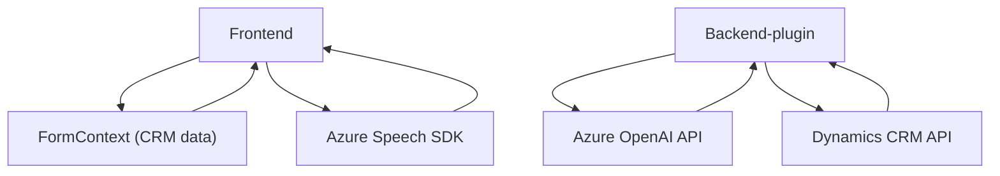

### Breve resumen técnico
El repositorio contiene tres componentes principales:
1. **Frontend (JavaScript)**: Archivos para interactuar con formularios en una aplicación CRM (Dynamics 365). Incluyen funcionalidades para entrada/salida de voz utilizando Azure Speech SDK y procesamiento de formularios basados en IA.
2. **Plugin (C#)**: Un complemento de Dynamics CRM que utiliza Azure OpenAI para transformar texto en JSON estructurado según normas específicas.

### Descripción de arquitectura
1. **Tipo de solución**: Varios módulos integrados en una solución híbrida que combina una interfaz cliente (Javascript) y lógica de backend (C#).
   - **Frontend**: Implementa operaciones de entrada de voz y síntesis de texto utilizando Azure Speech SDK, procesando datos de formularios en Dynamics 365.
   - **Backend/plugin**: Procesa textos mediante Azure OpenAI integrándose directamente con Dynamics CRM.
2. **Arquitectura**:
   - **Frontend**: Modular, con diseño procedural para facilitar separación de responsabilidades.
   - **Backend**: Complemento basado en `IPlugin`, siguiendo las prácticas de desarrollo para Dynamics CRM.

### Tecnologías usadas
1. **Frontend**:
   - **Azure Speech SDK**: Entrada y salida de voz.
   - **Dynamics 365 (Xrm SDK)**: Manipulación de datos del CRM.
   - **JavaScript**: DOM dynamic script loading y lógica procedural.
2. **Backend**:
   - **.NET Framework (C#)** para desarrollo del plugin.
   - **Azure OpenAI**: Procesamiento de datos con modelos GPT-4 en Azure.
   - **Newtonsoft.Json** para manipulación de JSON.
   - **Dynamics CRM API**.

### Patrones utilizados
1. **Encapsulación funcional** en frontend: Métodos diseñados para ejecutar tareas específicas como obtención de datos visibles, síntesis de texto y entrada de voz.
2. **Modularidad en backend** con métodos bien definidos para cada etapa del flujo, incluyendo manejo de servicios remotos.
3. **Plugin Architecture** en Dynamics CRM: Comparte datos desde el entorno CRM hacia servicios externos (Azure OpenAI).

### Dependencias externas
1. **Azure Speech SDK**: Cargado dinámicamente para usar funcionalidades de entrada/salida de voz.
2. **Azure OpenAI**: API externa usada por el plugin para transformar textos, configurada con claves específicas.
3. **Dynamics CRM SDK**: Depende de los servicios de la plataforma para obtener datos de usuario y configurar elementos dinámicos.

### Diagrama Mermaid

### Conclusión final
La solución refleja una arquitectura modular e híbrida, con un enfoque directo en la integración de herramientas IA (Azure Speech SDK y Azure OpenAI) con Dynamics CRM. Es idónea para casos en los que se requiere interacción rica con datos CRM mediante voz. Aunque funcionalmente robusta, podrían mejorar la seguridad (almacenamiento dinámico de credenciales) y la detección avanzada de errores, especialmente al interactuar con servicios externos como Azure.