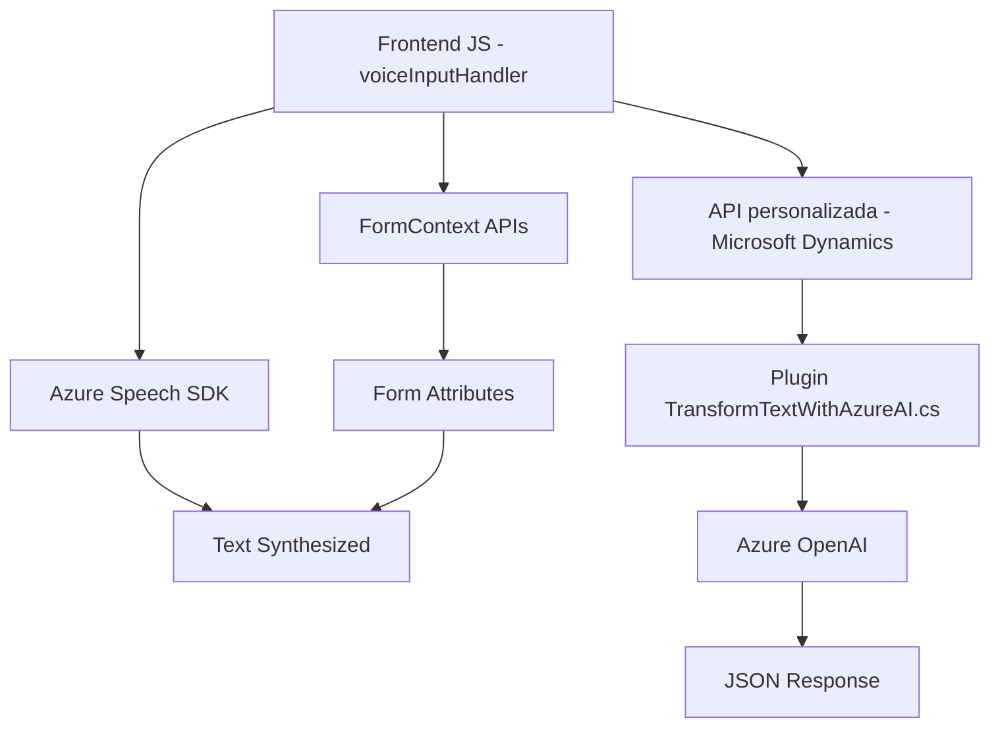

### Breve resumen técnico

El repositorio contiene diferentes componentes que, al analizar la estructura de los archivos proporcionados, apunta a una solución orientada hacia un sistema basado en formularios con capacidades avanzadas de interacción mediante voz y procesamiento de texto mediante inteligencia artificial (IA). Utiliza:

1. **Frontend** en JavaScript para manejar la interacción del usuario y la síntesis de voz.
2. **Plugins backend** en C# para transformar datos de entrada textual utilizando Azure OpenAI.
3. Dependencias con servicios de Microsoft Dynamics CRM como contexto primario.

---

### Descripción de arquitectura

La solución utiliza una arquitectura orientada a la integración de servicios **n capas** que combina un frontend interactivo (basado en voz) y un backend enriquecido con APIs y plugins. Los componentes relevantes son:

1. **Frontend**:
   - Procesa datos visibles del formulario.
   - Usa **Azure Speech SDK** para generar síntesis de voz y transcribir audio a texto.
   - Modula las interacciones con APIs externas y funcionalidades de IA.

2. **Backend**:
   - Utiliza **Microsoft Dynamics CRM Plugins** para extender la funcionalidad estándar del sistema. Estos plugins procesan texto mediante **Azure OpenAI** y devuelven respuestas estructuradas en formato JSON.

La arquitectura general es híbrida, en su núcleo utiliza la modularidad del modelo **n capas**, combinando frontend interactivo y lógica de negocio en el backend CRM, pero con una clara orientación a microservicios para la integración con Azure Speech y OpenAI.

---

### Tecnologías usadas

1. **Frontend**:
   - **Lenguaje:** JavaScript.
   - **Frameworks/SKD:** Azure Speech SDK.
   - **APIs del formulario:** APIs nativas de Microsoft Dynamics para acceder y manipular datos visibles.

2. **Backend**:
   - **Lenguaje:** C#.
   - **Framework:** SDK para Desarrollo de Plugins en Microsoft Dynamics CRM.
   - **Servicios externos:** Azure OpenAI.

3. **Dependencias comunes y protocolos**:
   - **REST APIs:** Usadas para interactuar con Azure OpenAI y posiblemente otros servicios externos (ej. Microsoft Dynamics Web API).

---

### Diagrama Mermaid válido para GitHub

---

### Conclusión final

Esta solución combina tecnologías avanzadas para mejorar la interacción de formularios en entornos empresariales, integrando accesibilidad por voz con procesamiento de texto basado en IA. Su arquitectura modular permite una integración eficiente de servicios externos como Azure Speech SDK y OpenAI API en el contexto de Microsoft Dynamics CRM.

Implementa patrones como **n capas** y carga dinámica de recursos, optimizando el rendimiento y la modularidad de la solución. Aunque no adopta completamente el modelo de microservicios, utiliza herramientas modernas para delegar funcionalidades específicas en servicios externos, lo que mejora la escalabilidad y mantenibilidad.