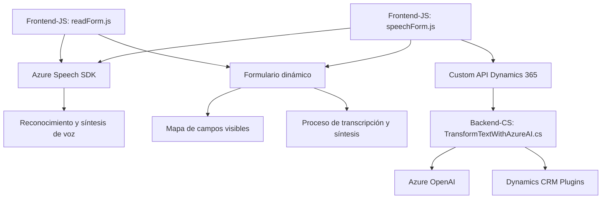

## Breve Resumen Técnico

El repositorio parece estar compuesto por múltiples módulos que interactúan con formularios de una aplicación empresarial, posiblemente Dynamics 365. Los módulos se enfocan principalmente en integrar capacidades de inteligencia artificial y servicios en la nube, específicamente con Azure Speech SDK y Azure OpenAI. El frontend facilita la captura y síntesis de voz, mientras que el backend realiza procesamiento avanzado de texto y transformación estructurada.

---

## Descripción de Arquitectura

La solución implementa una **arquitectura cliente-servidor distribuida**, donde el cliente (frontend) interactúa con el usuario para capturar y procesar datos desde formularios, y el backend (plugin) realiza tareas especializadas como transformación de texto mediante inteligencia artificial. Existen características de arquitectura en capas:
1. **Capa de presentación**: Representada por los módulos frontend en JavaScript.
2. **Capa de lógica de negocio**: Los plugins de Dynamics CRM implementan reglas de negocio y conexión con APIs externas.
3. **Capa de servicio/aplicación**: Representada por las integraciones con Azure Speech SDK y Azure OpenAI.

Aunque se usan tecnologías modernas como SDKs y APIs en la nube, el diseño no se define como microservicios ni como hexagonal; es más cercano a una arquitectura de **n capas** con servicios complementarios.

---

## Tecnologías Usadas

1. **Frontend**:
   - Lenguaje: JavaScript (ES6).
   - Integraciones:
     - **Azure Speech SDK**: Usado para captura de voz y síntesis.
     - **Dynamics 365 Web APIs**: Para mapear datos en formularios y ejecutar lógica.
   - Patrones:
     - Procedural basado en funciones.
     - Delegación (para carga dinámica de SDK y callbacks).

2. **Backend** (Dynamics CRM Plugins):
   - Lenguaje: C# (.NET Framework).
   - Frameworks:
     - **Dynamics CRM SDK**: Para construir plugins personalizados.
     - **System.Net.Http**: Para llamadas HTTP.
     - **Newtonsoft.Json.Linq**: Para manejo de JSON.
   - Servicios:
     - **Azure OpenAI**: Transformación textual mediante modelos GPT.
   - Patrones:
     - Plugin-design (interfaz `IPlugin`).
     - Cliente-Servidor (API HTTP para interacciones con Azure OpenAI).

3. **Servicios Externos**:
   - **Azure Speech SDK**: Captura de voz y síntesis directamente desde formularios.
   - **Azure OpenAI (gpt-4o)**: Para reglas avanzadas de transformaciones textuales.
   - CDN dinámico: Para importar SDKs según necesidad.

---

## Diagrama Mermaid 100% Compatible con GitHub Markdown

---

## Conclusión Final

Esta solución es un sistema híbrido que combina capacidades del cliente (presentación y lógica ligera) y el servidor (procesamiento intensivo). Se utiliza una arquitectura basada en capas, donde cada módulo tiene responsabilidad específica. La integración con servicios externos como Azure Speech SDK y Azure OpenAI amplía las capacidades del sistema, permitiendo usar inteligencia artificial y síntesis de voz directamente desde formularios empresariales. Es una implementación moderna basada en tecnologías de nube y prácticas estándar para aplicaciones empresariales distribuidas.