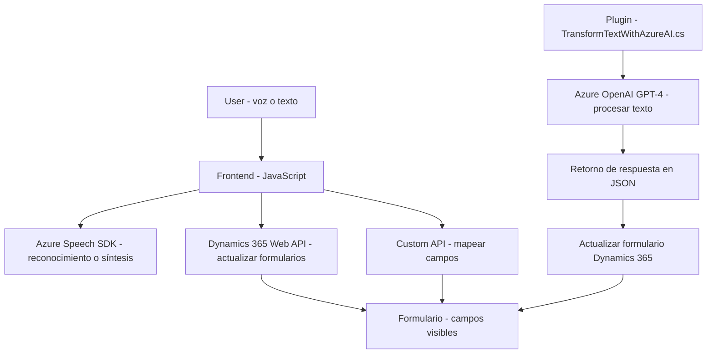

### Breve resumen técnico
El repositorio parece albergar una solución híbrida que integra **front-end** basado en JavaScript y funcionalidades específicas extendidas mediante plugins en Dynamics 365 CRM escritos en C#. La solución está orientada a implementar capacidades avanzadas de interacción utilizando voz y procesamiento de texto con **Azure AI (OpenAI y Speech SDK)**, facilitando la manipulación de formularios en Dynamics 365.

---

### Descripción de arquitectura
La solución adopta una arquitectura **modular** con elementos de **n capas**. Cada componente cumple roles claramente diferenciados:
1. **Frontend (JavaScript)**: 
   - Implementa lógica de interacción del usuario mediante síntesis y entrada de voz (Azure Speech SDK).
   - Procesos dinámicos de mapeo y actualización de formularios en Dynamics 365.

2. **Plugins (C#)**:
   - Adhiere al **patrón de plugins** típico en Dynamics CRM.
   - Proporciona lógica personalizada para el procesamiento avanzado de textos aprovechando Azure AI (GPT-4).

3. **Microservicios/Servicios Externos**
   - Comunicación con APIs externas: Azure Speech SDK para funcionalidad de entrada/salida de voz y Azure OpenAI para procesamiento de texto.

---

### Tecnologías, frameworks y patrones usados
1. **En el front-end**:
   - **JavaScript** sin frameworks específicos pero con módulos bien definidos.
   - **Azure Speech SDK** para síntesis y reconocimiento de voz.
   - **Dynamics 365 Web API** para manejar datos de formularios.

2. **En el back-end (C#)**:
   - **Dynamics CRM SDK** (`Microsoft.Xrm.Sdk`) para eventos y servicios de CRM.
   - **Azure OpenAI** para procesamiento de texto avanzado.
   - **HttpClient** para comunicación con APIs externas.

3. **Patrones y conceptos**:
   - Modularización con funciones independientes en JS.
   - Arquitectura orientada a eventos (plugin en Dynamics CRM).
   - Uso extensivo del **Patrón API Client** para interactuar con servicios externos.
   - Acoplamiento limitado entre componentes frontend-backend, comunicados principalmente mediante APIs y registros dinámicos en CRM.

---

### Dependencias o componentes externos
1. **Azure Speech SDK**:
   Manejo de síntesis y reconocimiento de voz para funciones de frontend.

2. **Azure OpenAI (GPT-4)**:
   Procesamiento de texto avanzado y generación de respuestas estructuradas JSON.

3. **Dynamics 365 Web API**:
   Gestión de formularios y actualización de datos en el sistema CRM.

4. **JavaScript APIs del navegador**:
   Para cargar scripts dinámicamente y manejar el SDK de Azure.

5. **Dependencias del plugin (C#)**:
   - **Newtonsoft.Json** para manejo de JSON.
   - **System.Net.Http** para envío de solicitudes a Azure OpenAI.

---

### Diagrama Mermaid (válido para GitHub Markdown)

---

### Conclusión final
Esta solución combina de forma efectiva **tecnologías front-end modernas (JavaScript)** y capacidades avanzadas de procesamiento integradas en **plugins de Dynamics 365** (C#). Es robusta para manejar interacciones de voz y texto, mientras delega tareas críticas de procesamiento a servicios externos como **Azure Speech SDK** y **Azure OpenAI GPT-4**.

Ventajas de la solución:
- Modularidad y separación de responsabilidades en cada capa.
- Acoplamiento limpio entre módulos usando APIs.
- Integración con IA (OpenAI) para facilitar la automatización y mejora de precisión en la gestión de textos.

Aspectos a mejorar:
- Almacenamiento seguro de claves de acceso en lugar de incluirlas directamente en el código.
- Documentación del proceso para facilitar el onboarding y escalabilidad.

La arquitectura n capas, junto con la modularidad e integración de servicios externos, hacen que esta solución sea flexible y escalable, ideal para una aplicación que interactúa con Dynamics CRM mediante métodos modernos.