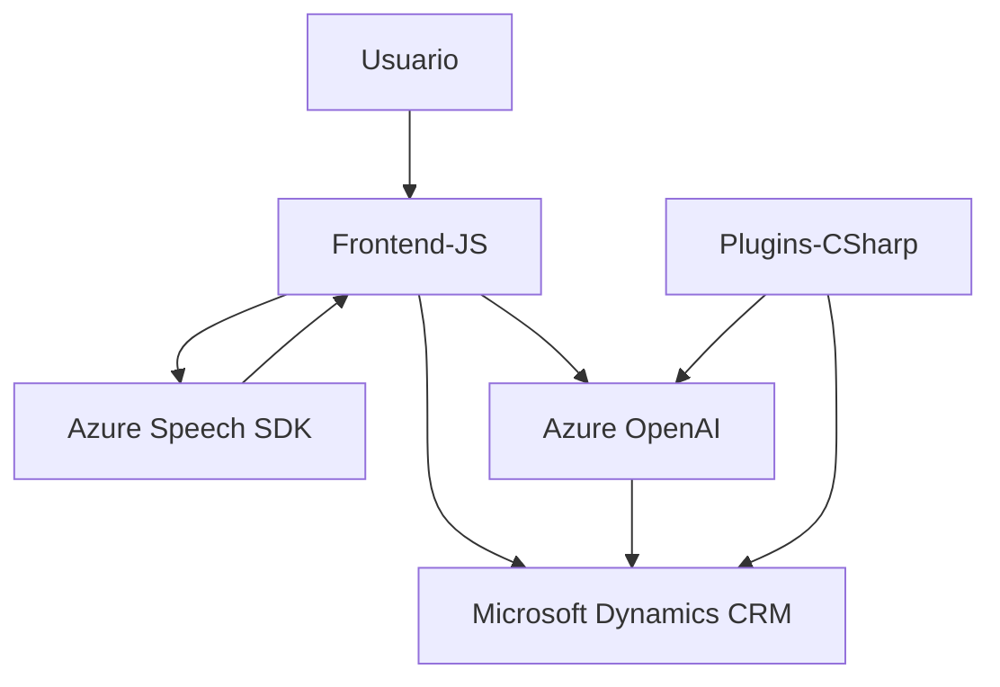

## Resumen Técnico General
El repositorio analizado parece estar enfocado en la **integración de reconocimiento de voz y procesamiento de formularios dinámicos** dentro de un sistema CRM (como Dynamics 365). Incluye componentes para la **lectura en voz, transformación de texto mediante IA de Azure, y modificaciones dinámicas en formularios CRM**. El repositorio utiliza módulos tanto en frontend (JavaScript), como en backend (plugin en C#).

## Descripción de Arquitectura
La arquitectura del sistema puede clasificarse como una solución de integración en **n capas**, donde cada nivel tiene responsabilidades claramente definidas:
1. **Capa de presentación (Frontend/JS)**: Maneja la interacción visual y funcional con el usuario (lectura en voz alta de formularios, reconocimiento de voz).
2. **Capa de negocio (Plugins)**: Transforma textos y realiza asignaciones complejas en el sistema CRM mediante reglas personalizadas y servicios de IA.
3. **Capa de integración externa**: Se conecta con los SDK y APIs de Azure (Speech y OpenAI) para ejecutar tareas especializadas como síntesis/reconocimiento de voz o transformación inteligente de texto.

Adicionalmente, se observa un uso parcial del enfoque **modular**, en el cual cada funcionalidad compleja (lectura de voz, asignación en formularios dinámicos, transformación de texto) está encapsulada en sus propias funciones o clases.

## Tecnologías Usadas
1. **Frontend (JavaScript)**:
   - Azure Speech SDK: Para reconocimiento de voz y síntesis de voz desde texto.
   - Promises y gestión de asincronía: Para interactuar con la API de Azure Speech y otros componentes.
   
2. **Backend (C#)**:
   - Microsoft Dynamics CRM SDK para desarrollo de plugins.
   - Azure OpenAI Service: Potenciado por GPT-4, para transformar texto a estructuras JSON basadas en reglas predefinidas.
   - Newtonsoft.Json o System.Text.Json: Tratamiento avanzado de estructuras JSON.
   - System.Net.Http: Para consumir APIs externas.

3. **Patrones avanzados**:
   - **Cargador dinámico de dependencias**: SDK de Azure Speech se carga solo cuando es necesario.
   - **Encapsulación de funcionalidad**: Código modular con funciones responsables de tareas específicas en el frontend.
   - **Plugin Pattern** en backend: Utilizado en entornos Dynamics CRM para extender funcionalidades.
   - **Integración de APIs externas** mediante HTTP para comunicación con Azure Speech y OpenAI.

## Diagrama Mermaid

## Conclusión Final
Esta solución representa una arquitectura híbrida en **n capas** combinada con **integraciones externas robustas**. La dependencia del API de Azure Speech facilita la lectura y reconocimiento de voz, mientras que el uso avanzado de AI con Azure OpenAI proporciona capacidades de procesamiento semántico fuera del alcance de aplicaciones estándar de CRM. La separación lógica entre funciones del frontend y plugins backend asegura modularidad y escalabilidad necesarias para sistemas empresariales complejos.