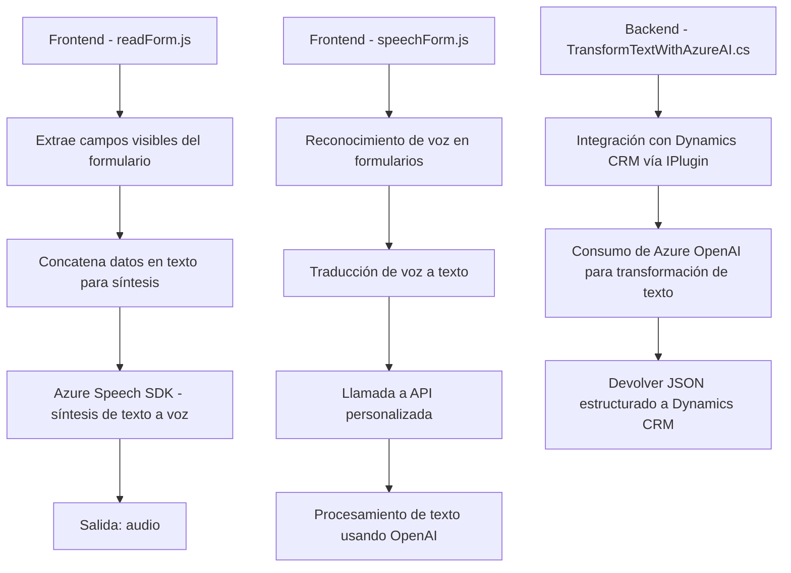

### Resumen técnico

El repositorio contiene componentes para la integración de APIs de Microsoft Dynamics CRM con servicios de reconocimiento de voz (Azure Speech SDK) y procesamiento de lenguaje natural (Azure OpenAI GPT). Incluye módulos frontend en JavaScript para interactuar con formularios dinámicos y un plugin en C# para trabajar con Dynamics CRM.

---

### Descripción de la arquitectura

1. **Tipo de solución**:  
   - El proyecto es una solución híbrida que mezcla una interfaz **frontend** (JavaScript) con un **plugin backend** (C#) integrado con **Microsoft Dynamics CRM**.  
   - La funcionalidad se centra principalmente en la interacción y manipulación de formularios, con soporte para **reconocimiento de voz** y **procesamiento textual avanzado mediante IA**.  

2. **Arquitectura y patrones**:  
   - **Arquitectura n capas**:  
     El repositorio organiza sus componentes con separaciones claras entre lógica del frontend (JS) que gestiona interacción con el usuario y un backend que manipula directamente los datos del CRM.  
   - **Integración con servicios externos**:
     Aprovecha servicios externos como **Azure Speech SDK** y **Azure OpenAI** para ampliar las capacidades del sistema.  
   - **Plugin Pattern**:
     En el backend, el uso de plugins de Dynamics CRM estructurados bajo la interfaz `IPlugin` es un estándar que permite asociar lógica de negocio a eventos del sistema CRM.  

3. **Tecnologías usadas**:  
   - **Frontend**:
     - **JavaScript**: Implementación modular para lectura de formularios y síntesis de voz.  
     - **Azure Speech SDK**: Reconocimiento de voz y síntesis de texto a audio.
   - **Backend**:
     - **C# en .NET**: Desarrollo de plugin para Dynamics CRM.  
     - **Biblioteca Newtonsoft.Json**: Manejo de JSON dinámico en plugin.  
     - **System.Net.Http**: Consumo de APIs externas mediante llamadas HTTP.  
     - **Azure OpenAI**: Procesamiento de texto con GPT (servicio externo).  

4. **Dependencias externas**:  
   - **Frontend**:
     - SDK de reconocimiento y síntesis de voz: Cargado desde un CDN.  
     - Dinámica externa relacionada con el contexto del formulario (`Dynamics CRM formContext`).
   - **Backend**:  
     - Servicio de Azure OpenAI para el procesamiento de texto.  
     - Interoperabilidad nativa de Microsoft Dynamics CRM (`IPlugin`).  
     - Conexión API a través de `System.Net.Http` para consumir servicios Azure.  

---

### Diagrama Mermaid compatible con GitHub Markdown

---

### Conclusión final

El repositorio presenta una solución bien integrada para extender las capacidades de Microsoft Dynamics CRM mediante reconocimiento de voz, síntesis de voz y procesamiento de texto con IA. La arquitectura basada en n capas permite separar responsabilidades, mientras que los patrones como plugins y servicios externos garantizan escalabilidad y modularidad. Las tecnologías principales son Azure Speech SDK para interacción por voz y Azure OpenAI para estructuración avanzada de datos. Es una solución robusta orientada a mejorar la experiencia del usuario en entornos empresariales.