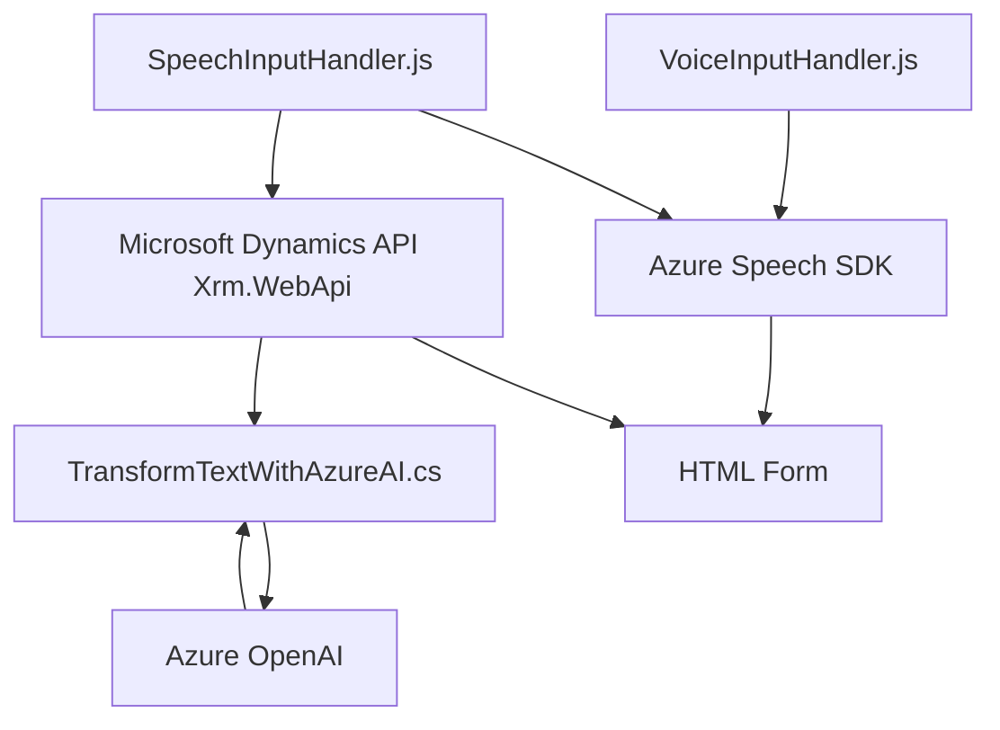

### **Breve resumen técnico**
El repositorio se centra en la integración de servicios de reconocimiento y síntesis de voz (usando **Azure Speech SDK**) y procesamiento semántico de datos (inteligencia artificial usando **Azure OpenAI**) en un entorno de formularios, probablemente basado en **Microsoft Dynamics CRM**. Se divide en tres componentes principales:
- **Frontend (VoiceInputHandler.js y SpeechInputHandler.js):** Se implementan funcionalidades relacionadas con entrada y salida de voz.
- **Backend (TransformTextWithAzureAI.cs):** Implementa lógica empresarial usando el patrón plugin para Microsoft Dynamics CRM.

---

### **Descripción de arquitectura**
La solución utiliza una arquitectura híbrida compuesta por:
1. **Patrón MVC simplificado:** En el frontend, las funciones actúan como controladores que procesan datos desde la vista (formulario) y los transforman utilizando servicios de Azure (modo modelo).
2. **Microservicio externo:** Se integra Azure OpenAI como un servicio externo para procesamiento mediante inteligencia artificial.
3. **Plugin del lado del servidor:** El archivo backend (C#) sigue el patrón de extensibilidad típico de Microsoft Dynamics CRM, usando el patrón de "plugin service" para ejecutar lógica personalizada dentro del sistema.
4. **Acoplamiento con SDK y APIs externas:** La solución depende en gran medida de los SDK y APIs de Azure para la síntesis/reconocimiento de voz y procesamiento de lenguaje natural.

---

### **Tecnologías usadas**
1. **Frontend:**
   - **JavaScript:** Para lógica de entrada/salida de voz y actualización del DOM.
   - **Azure Speech SDK:** Para reconocimiento de voz y síntesis de voz.
   - **Microsoft Dynamics API (`Xrm.WebApi`)**: Acceso y manipulación de formularios en Dynamics CRM.

2. **Backend:**
   - **C#:** Para desarrollo del plugin.
   - **Azure OpenAI API (usando un modelo GPT):** Para procesamiento semántico del texto.
   - **JSON Libraries:** `Newtonsoft.Json.Linq`, `System.Text.Json` para transformación y manipulación de datos JSON.

---

### **Dependencias o componentes externos**
1. **Azure Speech SDK:** Utilizado para entrada/salida de voz.
2. **Azure OpenAI:** Para transformación semántica de datos vía modelo GPT.
3. **Dynamics CRM (`Xrm.WebApi`):** Para manipulación de formularios y datos organizacionales.
4. **HTTP Client Libraries:** Usadas para invocar APIs como Azure OpenAI desde C#.

---

### **Diagrama Mermaid**

---

### **Conclusión final**
Esta solución representa una implementación moderna que aprovecha capacidades avanzadas de servicios en la nube como **Azure Speech SDK** y **Azure OpenAI** en un entorno empresarial, específicamente Microsoft Dynamics CRM. La arquitectura permite extender funcionalidad mediante un plugin modular y procesar datos en tiempo real, tanto en el backend (con transformación semántica) como en el frontend (interacción por voz). Sin embargo, el alto acoplamiento con servicios Azure puede ser un área de riesgo en términos de flexibilidad y costos operativos. 

El diseño es robusto para el propósito, pero optimizable en términos de desacoplamiento y extensión futura.