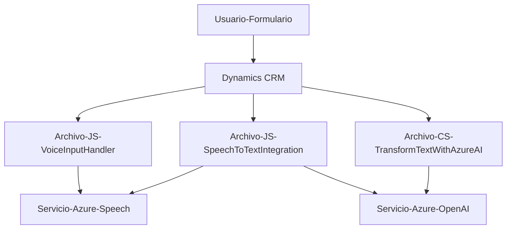

### Breve resumen técnico

El repositorio contiene componentes que proporcionan la siguiente funcionalidad:
- **Frontend**: Módulos en JavaScript que integran formularios de Dynamics CRM/365 con servicios de voz y síntesis de habla proporcionados por **Azure Speech SDK**.
- **Backend/plugin**: Código en C# que agrega funcionalidad personalizada a Dynamics CRM mediante el uso de **Azure OpenAI GPT** para transformar textos según reglas específicas.

La solución general busca mejorar la interacción del usuario a través de capacidades de inteligencia artificial (procesamiento de voz y texto), aprovechando servicios en la nube (Azure Speech y Azure OpenAI) integrados con Dynamics CRM.

---

### Descripción de arquitectura

La arquitectura combina funcionalidades de frontend y backend integradas con servicios en la nube:
- **Frontend**:
  - Modularidad por funciones específicas para procesamiento de datos de formularios.
  - Integración con Azure Speech SDK mediante carga dinámica de dependencias.
  - Arquitectura basada en interacción entre el cliente (JavaScript) y servicios externos (Azure Speech).
- **Backend**:
  - Plugin en C# para Dynamics CRM diseñado bajo un patrón **evento-acción** (basado en la interfaz `IPlugin` de Dynamics).
  - Interacción y transformación de datos mediante servicios externos (Azure OpenAI).

La solución podría clasificarse como una **arquitectura de microfrontend con integración cloud** y un **backend desacoplado con Azure**. A nivel global, es una mezcla de **multi-capas** y **orientación a servicios**.

---

### Tecnologías usadas

#### Frontend:
- **JavaScript**: Gestión de lógica de cliente y conexión dinámica con SDK de Azure.
- **Azure Speech SDK**: Procesamiento de voz (reconocimiento y síntesis).
- **Dynamics CRM Web API**: Para interacción con formularios y configuración de Dynamics 365.

#### Backend:
- **C#**: Para implementar plugins de Dynamics CRM.
- **Microsoft Dynamics CRM SDK**: Extendibilidad mediante la interfaz `IPlugin`.
- **Azure OpenAI GPT-4**: Procesador de texto avanzado.
- **Newtonsoft.Json y System.Text.Json**: Para trabajar con JSON.
- **System.Net.Http**: Envío de solicitudes HTTP a servicios externos.

#### Otros patrones:
- **Carga dinámica de dependencias** en el frontend (SDK de voz).
- **Separación de responsabilidades**: Métodos enfocados en tareas específicas.
- **Desacoplamiento con servicios externos** para cloud computing.

---

### Diagrama Mermaid (estructura básica)

---

### Conclusión final

La solución integra tecnologías de vanguardia como Azure Speech SDK y Azure OpenAI para mejorar la interacción con sistemas empresariales centralizados, como Dynamics CRM/365. Utiliza diversos patrones como modularidad, desacoplamiento, y servicios distribuidos para la síntesis y reconocimiento de voz y procesamiento de texto. Esta arquitectura híbrida (microfrontend + backend conectado con servicios en la nube) permite desarrollar aplicaciones empresariales accesibles, inteligentes y capaces de extender las capacidades existentes en entornos tradicionales como Dynamics CRM.