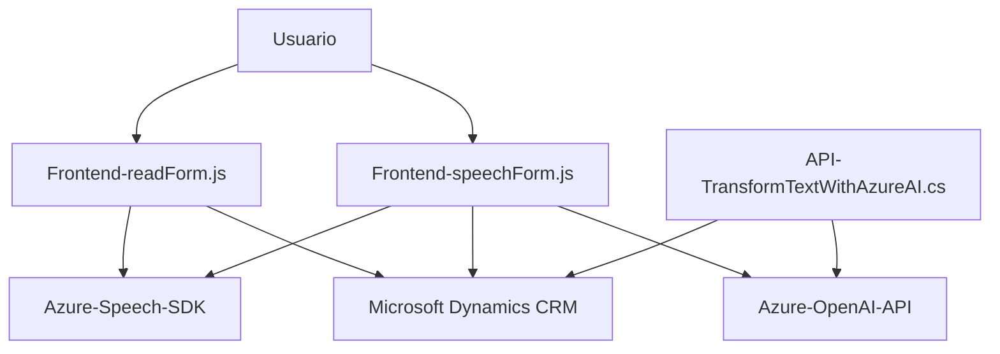

### **Resumen técnico:**
El repositorio contiene una solución orientada a integrar capacidades de reconocimiento, síntesis de voz y procesamiento de texto para su uso en aplicaciones vinculadas a formularios en un entorno Microsoft Dynamics CRM. La implementación se basa en un enfoque modular que utiliza tecnologías modernas como el SDK de Azure Speech y la API Azure OpenAI para potenciar las interacciones con datos dinámicos.

---

### **Descripción de arquitectura:**
La solución utiliza una arquitectura **n-capas** bien definida:
1. **Capa de presentación** (Frontend):
   - Constituida por los archivos `readForm.js` y `speechForm.js`.
   - Maneja la interacción con el usuario, leyendo y escribiendo datos en formularios basados en Microsoft Dynamics CRM.
   - Incluye la integración de servicios de voz y API a través del cliente web.
2. **Capa del negocio** (Plugins):
   - Archivo `TransformTextWithAzureAI.cs`.
   - Proporciona lógica empresarial avanzada, como el procesamiento inteligente de texto basado en Azure OpenAI.
3. **Capa de datos**:
   - Integración directa con Microsoft Dynamics CRM API para mantener la persistencia y consulta de datos.

---

### **Tecnologías usadas:**
1. **Frontend:**
   - **JavaScript:** Principal lenguaje utilizado para la interacción con el usuario.
   - **Azure Speech SDK:** Para realizar síntesis y transcripción de voz.
   - **Microsoft Dynamics API (XRM.WebApi.online):** Utilizado para interactuar con el CRM y guardar los datos.
2. **Backend:**
   - **Microsoft Dynamics Plugin SDK:** Maneja la lógica de transformación de texto y la integración con CRM.
   - **Azure OpenAI API (GPT-4):** Procesamiento avanzado de texto usando modelos de lenguaje preentrenados.
3. **Otros:**
   - **JSON (System.Text.Json y Newtonsoft.Json)** para gestionar datos estructurados.
   - **HTTP Client:** Para realizar solicitudes al servicio Azure OpenAI API.

---

### **Diagrama Mermaid**

---

### **Conclusión final:**
La solución está diseñada para transformar los procesos manuales de entrada de datos en formularios condensados dentro de un ecosistema de Microsoft Dynamics CRM mediante el uso de tecnologías emergentes como Azure Speech SDK para reconocimiento de voz y Azure OpenAI para transformación inteligente de texto. La arquitectura es una **estructura n-capas**, sencilla pero capaz de gestionar interacciones entre capas distintas manteniendo modularidad y escalabilidad. Sin embargo, se identificaron áreas de mejora, como asegurar las claves de API y refactorizar para aprovechar mejor principios como la inyección de dependencias.