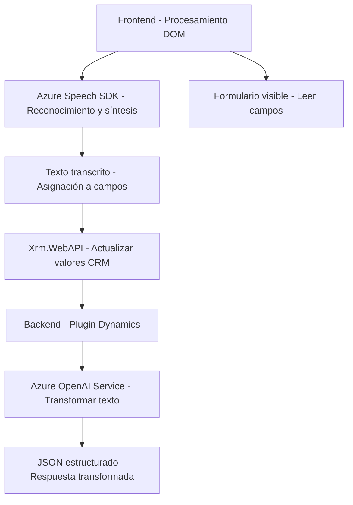

### Breve resumen técnico:
El repositorio contiene soluciones relacionadas con la integración entre formularios web, reconocimiento de voz, síntesis de voz y transformación de texto basado en inteligencia artificial. Utiliza tecnologías como Azure Speech SDK y OpenAI Service, junto con APIs propias de Dynamics CRM. Todos los archivos siguen principios de modularidad y reusabilidad, permitiendo la incorporación de accesibilidad y automatización inteligente en entornos web y de gestión empresarial.

---

### Descripción de arquitectura:
1. **Tipo de solución:**  
   Es una solución híbrida donde convergen un frontend para interacción de usuario (procesamiento y síntesis de voz en tiempo real) y un backend basado en plugins de Dynamics CRM para transformación de texto mediante normas predefinidas con Azure OpenAI. El proyecto parece diseñado para mejorar la accesibilidad y automatizar tareas en plataformas CRM mediante tecnologías modernas.

2. **Patrones de arquitectura:**  
   - **Frontend:** Patrón de capas basado en modularidad funcional, donde cada función tiene un propósito claro y conciso (extracción de datos, transformación y síntesis).
   - **Backend:** SOA (Service Oriented Architecture) con integración de servicios externos (Azure OpenAI y APIs de CRM Dynamics).
   - **SDK Loader Pattern:** Se utiliza un cargador dinámico para importar el SDK de Azure Speech sólo cuando es necesario.
   - **Callback y promesas:** Manejo de flujos asíncronos para operaciones externas, garantizando un procesamiento sin bloqueo.

3. **Tipo de arquitectura:**  
   - **Frontend:** Implementa un esquema de varias capas (procesamiento del DOM, comunicación con terceros, síntesis de voz).
   - **Backend (plugin):** Arquitectura orientada a servicios (SOA) junto con principios de extensibilidad propios de Dynamics CRM.

---

### Tecnologías usadas:
- **Frontend:**
  - **JavaScript:** Procesamiento de formularios y manipulación del DOM.
  - **Azure Speech SDK:** Para reconocimiento y síntesis de voz en el navegador.
  - **Dynamics API (Xrm.WebApi):** Actualización de formularios y atributos desde la aplicación web.
- **Backend:**
  - **C# y .NET:** Desarrollo del plugin de Dynamics CRM.
  - **Azure OpenAI Service:** Procesamiento avanzado basado en GPT.
  - **JSON:** Estructuración y transmisión de datos (API personalizada).

---

### Dependencias o componentes externos:
1. **Azure Speech SDK:** Procesamiento de voz en tiempo real para reconocimiento y síntesis.
2. **Azure OpenAI Service:** IA para transformación de texto.
3. **Dynamics CRM API:** Plataforma de gestión empresarial para datos y métodos internos.
4. **HTTP / REST APIs:** Comunicación entre frontend y backend usando JSON.
5. **Newtonsoft.Json:** Manejo y deserialización de objetos JSON en backend.

---

### Diagrama **Mermaid** válido para GitHub:

---

### Conclusión final:
Este repositorio ejemplifica una arquitectura híbrida orientada a servicios, enfocada en accesibilidad y procesamiento inteligente mediante IA y tecnologías modernas. Aunque la lógica del frontend y backend opera en capas independientes, se complementan mediante comunicación asincrónica y APIs externas. Esto permite extender funcionalidades de CRM Dynamics con reconocimiento de voz y transformación de texto, creando flujos de trabajo automatizados más accesibles y eficientes.