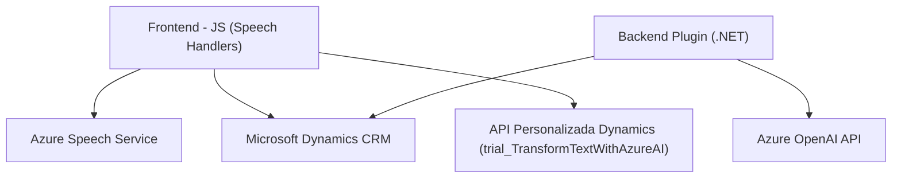

### Breve Resumen Técnico
Este repositorio está compuesto por una solución que integra un **frontend en JavaScript** y un **plugin backend en C# para Microsoft Dynamics CRM**. Su objetivo principal es mejorar la interacción del usuario con formularios en el sistema Dynamics CRM mediante la síntesis de voz y la interpretación de voz, además de implementar la transformación de texto basada en IA con Azure OpenAI.

### Descripción de la Arquitectura
La arquitectura parece ser de tipo **híbrida**:
1. **Frontend Modular (Capa de Presentación)**: Módulos en JavaScript interactúan directamente con el SDK de Azure Speech y la API del backend.
2. **Backend Plugin (Capa de Servicios)**: Plugin extensible de Dynamics CRM que actúa como puente entre los formularios y el servicio de Azure OpenAI.
3. **Integración con APIs Externas**: El sistema interactúa con servicios cloud (Azure Cognitive Services y OpenAI API), convirtiéndose en una semiarquitectura orientada a microservicios y basada en SaaS.

La solución presenta características propias de aplicaciones de n-capas pero con fuerte acoplamiento a servicios externas. Ideal para entornos de **Microsoft Dynamics 365** y **Azure**.

### Tecnologías Usadas
1. **Frontend**:
   - **JavaScript**: Procesamiento dinámico de datos y síntesis de voz.
   - **Servicios Azure Speech SDK**: Para análisis de voz y texto.
   - **Integración con Dynamics CRM**: Métodos específicos para gestionar datos de formularios.

2. **Backend (Plugin)**:
   - **C#**: Implementación del plugin en Microsoft Dynamics CRM.
   - **Azure OpenAI API**: Servicios GPT para transformación avanzada de texto.
   - **HTTP Client Libraries**: Comunicación con APIs externas.

3. **Dependencias Externas**:
   - **Microsoft Dynamics SDK**: Relación directa con formularios y registros.
   - **Azure Cognitive Services SDK y REST APIs**: Implementación de los servicios de voz.

### Diagrama Mermaid

### Conclusión Final
Este repositorio representa una solución que mejora la accesibilidad y usabilidad en entornos de Microsoft Dynamics CRM al integrar síntesis y reconocimiento de voz mediante Azure, complementado con inteligencia artificial. La arquitectura híbrida, combinada con dependencia considerable de sistemas externos como Azure Cognitive Services y OpenAI API, refleja características modernas pero depende significativamente de la disponibilidad y costo de estos servicios. Ideal para empresas que desean implementar una integración robusta y orientada al manejo de datos accesibles.