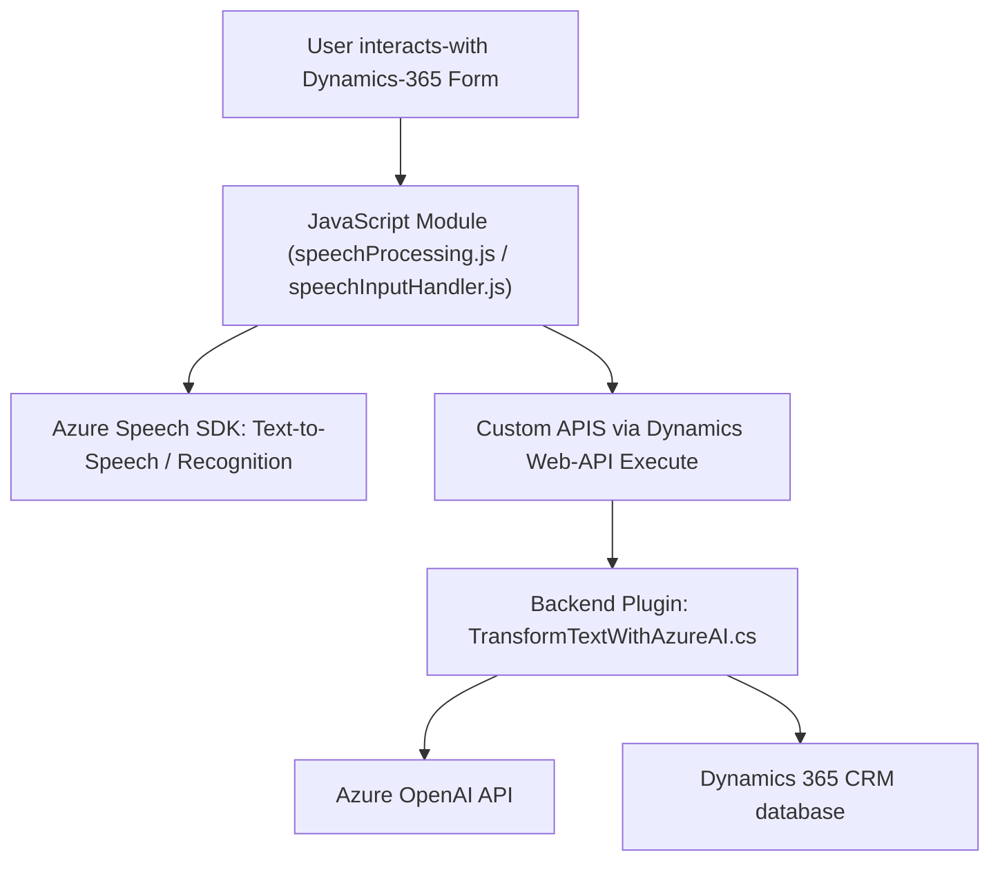

### Breve Resumen Técnico:  

El repositorio contiene implementaciones relacionadas con la integración de **Microsoft Dynamics 365**, **Azure Speech SDK** y **Azure OpenAI**. Los archivos proporcionados describen módulos frontend y backend que habilitan funcionalidades como lectura y síntesis de voz, procesamiento de voz y transcripción en formularios, así como la transformación de texto usando inteligencia artificial con integración directa a Dynamics 365 y servicios externos de Azure.

---

### Descripción de arquitectura:  

1. **Tipo de solución:**  
   - API y módulos para interacción con formularios de Dynamics 365.  
   - Incluye componentes frontend (JavaScript para formularios) y plugins backend (*.cs file).  

2. **Arquitectura identificada:**  
   - **Multicapa:** La solución sigue una arquitectura en capas:  
     - **Interfaz usuario (frontend JS):** Realiza operaciones con los formularios en Dynamics 365 mediante el objeto global `Xrm`.  
     - **Servicios backend (C# plugins):** Procesamiento de datos y comunicación con APIs externas, cumpliendo con los principios de desacoplamiento.  

---

### Tecnologías, frameworks y patrones usados:  

1. **Tecnologías y frameworks:**  
   - **Azure Speech SDK:** Usado en archivos JavaScript (frontend) para la síntesis y reconocimiento de voz (node.js-based SDK).  
   - **Azure OpenAI API:** Integración backend (plugin en C#).  
   - **Microsoft Dynamics 365 APIs:** Métodos `Xrm.WebApi.online.execute` en JS y `Microsoft.Xrm.Sdk` en C#.  

2. **Patrones de diseño:**  
   - **Service Integration:** Interacción directa con APIs externas y SDKs.  
   - **Callback:** Garantiza la sincronización y carga dinámica de SDK.  
   - **Encapsulación y separación de responsabilidades:** Funciones y métodos especializados, con clara delimitación entre extracción, transformación y comunicación.  
   - **Plugin Pattern:** El archivo C# sigue el esquema de plugins de Dynamics CRM, con una lógica bien definida en `Execute`.  

---

### Dependencias o componentes externos:  

1. **Microsoft Dynamics 365 Web APIs and SDK:**  
   Integra funcionalidad relacionada con formularios, datos y relaciones de entidades.  

2. **Azure Speech SDK:**  
   Usado en frontend para síntesis y reconocimiento de voz. (`https://aka.ms/csspeech/jsbrowserpackageraw`)  

3. **Azure OpenAI Service (GPT-x):**  
   Usado en plugins de backend para transformación de texto en JSON estructurado según reglas predefinidas.  

4. **HTTP Communication Libraries:**  
   - **Newtonsoft.Json.Linq** para gestionar JSON.  
   - Clases de .NET (e.g., `HttpClient`) para comunicación externa.  

---

### Diagrama Mermaid válido para GitHub Markdown:  

---

### Conclusión Final:  

La solución presentada integra la interfaz de usuario (frontend JavaScript) con servicios en la nube (Azure Speech SDK, OpenAI API), junto con una capa backend basada en plugins de Dynamics 365 CRM. La arquitectura sigue una estructura multicapa, adecuada para aplicaciones empresariales extensibles que combinan interfaz de usuario, procesamiento de datos y comunicación asincrónica con servicios externos. El diseño modular de funciones y métodos garantiza escalabilidad y facilidad de mantenimiento.