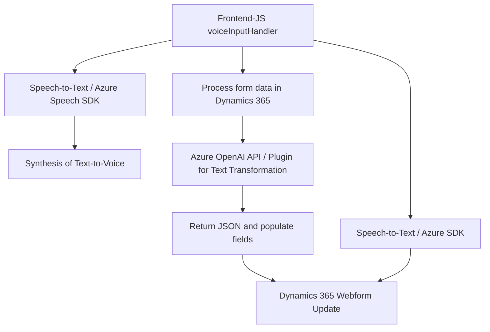

### Breve resumen técnico

El repositorio analiza soluciones de interacción entre formularios, reconocimiento, y síntesis de voz con integración a Dynamics 365 CRM y Azure OpenAI utilizando SDKs externos. Este software busca procesar datos de formularios tanto mediante voz (speech-to-text y text-to-speech) como vía inteligencia artificial (transformar texto y aplicarlo en formularios). Implementa receptor y productor de datos para optimizar la experiencia de usuario en un contexto empresarial.

---

### Descripción de arquitectura

Se identifica una **arquitectura cliente-servidor con diseño modular**, donde:
1. El **frontend** maneja la lógica de aplicación para interacción de formularios, reconocimiento y síntesis de voz (Azure Speech SDK).
2. El **backend** tiene un plugin basado en Dynamics 365 que permite la integración directa con los datos del CRM y realiza procesamiento avanzado vía **Azure OpenAI API**.

Además:
- **Frontend:** Sigue una arquitectura de separación de responsabilidades en funciones. Provee capacidades de integración con APIs externas y manipulación estructurada del DOM mediante el modelo de ejecución contextual de Dynamics 365.
- **Plugin:** Implementa el **plugin pattern** para extender las funcionalidades de Dynamics CRM. Este patrón permite ejecutar lógica personalizada en actividades específicas del sistema CRM.

---

### Tecnologías usadas

**Frontend:**  
- **JavaScript**: Base de la lógica en el controlador de formularios.  
- **Azure Speech SDK**: Para síntesis y reconocimiento de voz.  
- **Dynamics 365 Web API (`Xrm.WebApi`)**: Interactúa con formularios dinámicos.  

**Backend:**  
- **Microsoft Dynamics SDK (`Microsoft.Xrm.Sdk`)**: Manejo de contexto y operaciones relacionadas al CRM.
- **Azure OpenAI API**: Procesamiento avanzado de lenguaje natural.  
- **HTTP requests (`System.Net.Http`)**: Comunicación REST entre plugin y servicios de Azure.  
- **JSON parsers (`Newtonsoft.Json`)**: Manejo de estructuras JSON.  

---

### Diagrama Mermaid válido para GitHub

---

### Conclusión final

El análisis del repositorio refleja una solución diseñada para optimizar las interacciones con formularios de Dynamics 365, integrando tecnologías modernas de reconocimiento y síntesis de voz (Azure Speech SDK) junto con capacidades de procesamiento avanzado de datos mediante Azure OpenAI. La arquitectura cliente-servidor, con módulos bien definidos que cumplen el principio de responsabilidad única, asegura escalabilidad y mantenibilidad. Es una solución ideal para entornos empresariales que buscan mejorar la accesibilidad y automatización en sus sistemas CRM.