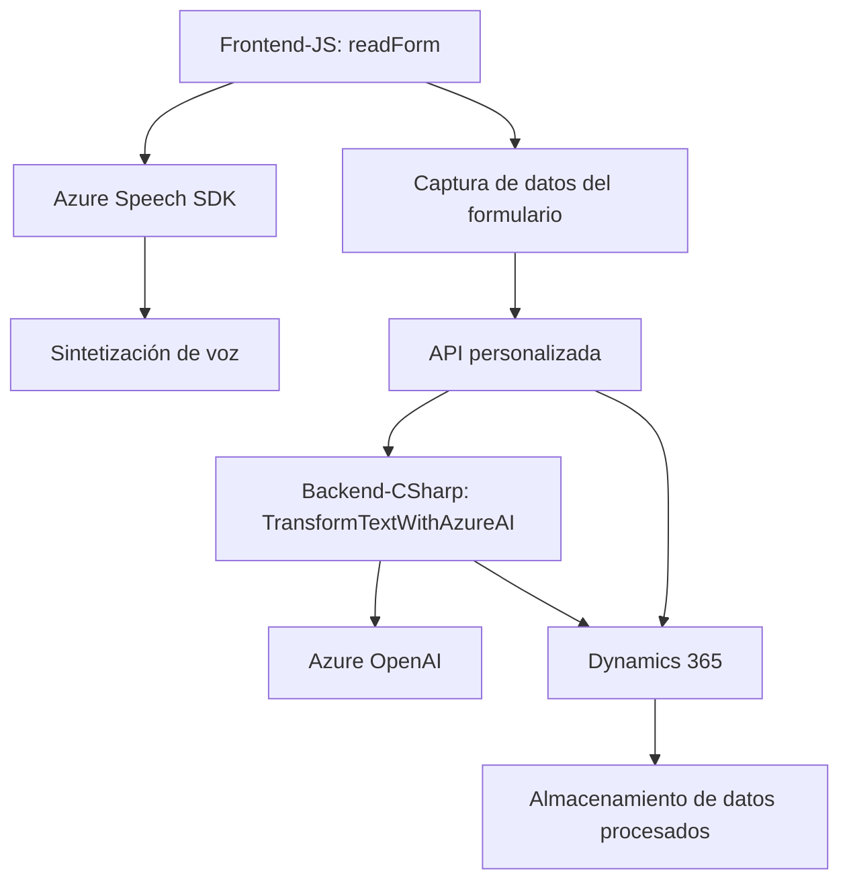

### Resumen técnico:  
Este repositorio define una solución orientada a la integración entre formularios dinámicos, entrada y salida de voz, y un servicio externo para transformación de texto (Azure Speech SDK y Azure OpenAI). Tres componentes principales están presentes: frontend (JavaScript), backend (C# Plugin para Dynamics 365), y una API personalizada.  

---

### Descripción de arquitectura:  
- **Tipo de solución:**  
  La solución general implementa una **aplicación híbrida** centrada en automatización y procesamiento de datos mediante voz y texto. Combina componentes de **frontend** (para entrada/salida de datos y voz), **backend** (un servicio plugin en Dynamics 365), y servicio externo (Azure Speech/AI).  

- **Arquitectura:**  
  La arquitectura tiene características de **microservicios** debido a la interacción modularizada entre frontend, backend y APIs externas. Adicionalmente, gran parte del diseño sigue el estilo de arquitectura orientada a eventos (event-driven), con callbacks y procesamiento asíncrono.  

- **Capas:**  
  Aunque los componentes son independientes, la arquitectura es ligeramente híbrida:  
  1. **Frontend** (capa de presentación): Manejo de datos del formulario y síntesis/reconocimiento de voz.  
  2. **Integración media/API** (servicios): Consumo de SDKs y APIs externas.  
  3. **Backend empresarial** (plugin en Dynamics 365): Transformación avanzada de texto en JSON estructurado para almacenamiento o análisis.  

---

### Tecnologías usadas:  
1. **Frontend:**  
   - **JavaScript:** Para el procesamiento en tiempo real de datos de formularios y llamadas al Azure Speech SDK.  
   - **Azure Speech SDK:** Sintetización y reconocimiento de voz.  

2. **Backend:**  
   - **C# Dynamics Plugin:** Extensión personalizada para Dynamics 365 usando Azure OpenAI.  
   - **Azure OpenAI:** Procesamiento de texto basado en IA, ajustado según reglas específicas.  
   - **Microsoft Dynamics WebApi.online:** Manipulación de formularios asociados a Dynamics CRM.  

3. **Patrones de diseño:**  
   - **Event-driven programming:** Uso intensivo de callbacks y gestión dinámica de dependencias en frontend.  
   - **Integración REST:** Consumo de servicios externos como Azure OpenAI.  
   - **Layered/modular architecture:** Segmentación de funciones específicas en módulos independientes.  

---

### Dependencias y componentes externos presentes:  
1. **Principales:**  
   - Azure Speech SDK (reconocimiento y síntesis de voz).  
   - Azure OpenAI GPT (transformación de texto).  
   - Dynamics 365 WebApi.online para integración con formularios y entidades (backend).  

2. **Secundarios (internos):**  
   - Plugin Dynamics (`TransformTextWithAzureAI.cs`) para manipular datos internos.  
   - API personalizada (`trial_TransformTextWithAzureAI`) utilizada para aumentar la funcionalidad.  

3. **Seguridad:**  
   - Uso de API keys para Azure Speech y Azure OpenAI.  
   - Hardcoded keys observadas en el plugin podrían representar riesgos.  

---

### Diagrama Mermaid (GitHub-compatible):  

---

### Conclusión final:  
La solución combina frontend y backend en una arquitectura distribuida. Presenta integración dinámica y modular con SDKs como Azure Speech y servicios de IA como Azure OpenAI, junto con Dynamics 365 para su uso empresarial. Su diseño arquitectónico exhibe un enfoque orientado a eventos con componentes modulares y patrones de integración RESTful. Aunque funcionalmente sólido, presenta potenciales riesgos de seguridad debido al manejo hardcoded de credenciales.  

Es un buen ejemplo de cómo los sistemas pueden integrar voz, IA y datos empresariales para una automatización eficiente en escenarios comerciales.