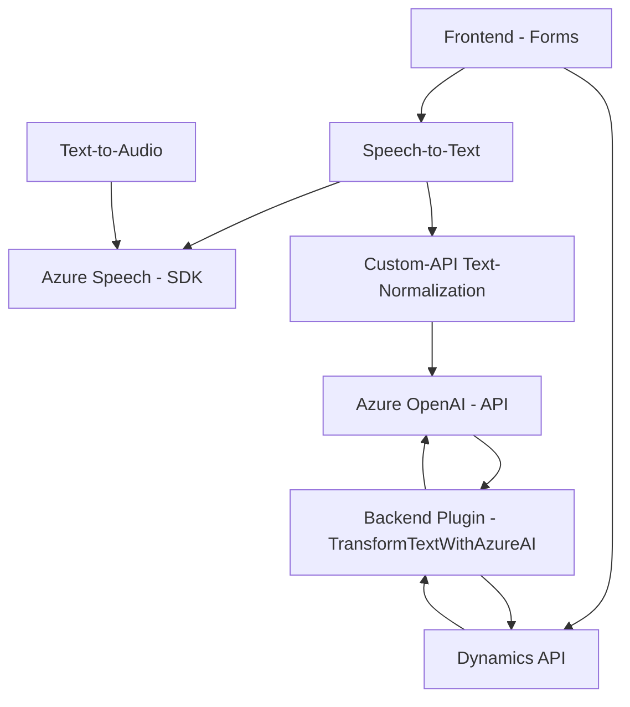

### **Breve resumen técnico**
El repositorio presenta una solución que combina tecnología de entrada/salida de voz y síntesis de texto basada en el **Azure Speech SDK**, integrándose directamente con **Microsoft Dynamics CRM**. La funcionalidad principal gira en torno a mejorar la interacción con formularios mediante reconocimiento/síntesis de voz y procesamiento avanzado de texto usando **Azure OpenAI**, ofreciendo una experiencia interactiva e inteligente.

---

### **Descripción de arquitectura**
La arquitectura general de la solución sigue paradigmas de **n capas** con integración de servicios externos como **Dynamics API** y **OpenAI** en Azure. Las capas identificadas son:
1. **Capa de presentación (Frontend)**: Código en **JavaScript** para manejar entrada/salida de voz en formularios y actualizar campos.
2. **Capa lógica de procesamiento (Plugins)**: Implementación de un **plugin Dynamics** para transformar datos textuales usando **Azure OpenAI**.
3. **Servicios externos**: Integración con:
   - **Azure Speech SDK** para síntesis de voz y reconocimiento.
   - **Custom API** basada en OpenAI para normalizar y estructurar datos en JSON.

Se observa un enfoque modular, donde los componentes tienen responsabilidades claramente definidas (como síntesis de voz, procesamiento de texto con IA, y conexión con Dynamics).

---

### **Tecnologías usadas**
1. **Frontend**:
   - **JavaScript**.
   - **Azure Speech SDK** para voz y reconocimiento.
   - **Dynamics Context API** para interacción con formularios.

2. **Backend**:
   - **C#** en .NET Framework con Microsoft SDK.
   - **Azure OpenAI API** para procesamiento de textos mediante inteligencia artificial.

3. **Patrones arquitectónicos**:
   - **N Capas**: Separación de presentación (Frontend), aplicación (JS/C# Plugins) y datos (Dynamics API).
   - **Modular programming** (Front y Plugin).
   - **Plugin Pattern**: Implementación de extensiones en el contexto de Dynamics CRM.
   - **REST API Wrapper**: Simplificación de llamadas externas mediante métodos.
   - **Callback and Promises** para manejo asíncrono de SDK y APIs en el frontend.

---

### **Dependencias y componentes externos**
1. **Microsoft Azure**:
   - **Speech SDK** para audio-texto y síntesis de voz.
   - **OpenAI API** para procesamiento avanzado (GPT o Codex).
2. **Dynamics CRM API**:
   - **Xrm.WebApi** para interacción directa con el contenido interno de formularios.
   - **Custom Plugin Framework**: Personalizaciones específicas para Microsoft Dynamics CRM.
3. **Newtonsoft.Json** para manipulación de JSON en C#.
4. **Frontend libraries**:
   - Importación dinámica de scripts (Azure SDK).

---

### **Diagrama Mermaid**

---

### **Conclusión final**
Este repositorio implementa una **solución híbrida cliente-servidor orientada a n capas y accesibilidad avanzada**. Combina aspectos de frontend interactivo (dinámico y modular) con integración backend basada en plugins y APIs de IA. Su arquitectura provee un diseño extensible para escenarios en Microsoft Dynamics CRM donde la entrada de voz, procesamiento IA del texto, y síntesis de audio potencian la productividad y accesibilidad.