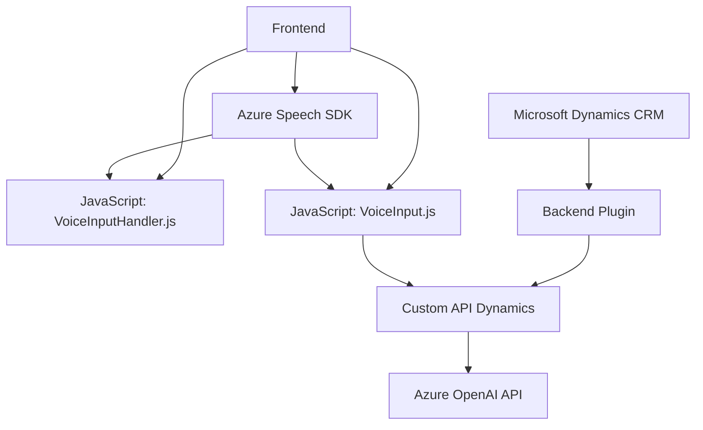

### Breve resumen técnico:
El conjunto de archivos analiza y transforma datos mediante la integración de tecnologías como **Azure Speech SDK** y **Azure OpenAI**, interactuando con **Microsoft Dynamics CRM**. Cada archivo tiene un propósito específico en un sistema modular centrado en la accesibilidad (voz y texto), formulación dinámica, e integración con inteligencia artificial.

---

### Descripción de arquitectura:
La arquitectura utilizada es **n capas**, dividida entre el frontend (procesamiento en el navegador) y el backend (lógica CRM + OpenAI). Los módulos están organizados de manera independiente, con responsabilidades claras:
1. **Frontend**:
   - Interacción de usuarios mediante reconocimiento de voz y generación de texto/habla.
   - Uso de servicios de voz y APIs en tiempo real.
2. **Backend**:
   - Función de plugin en Dynamics CRM que actúa como intermediario entre el usuario y Azure OpenAI.
   - Comunicación y transformación de datos entre el cliente y el servidor.

Patrones observados:
- **Modularidad**: Funciones y métodos bien definidos para mantener la cohesión y escalabilidad.
- **Carga dinámica de dependencias**: Scripts como el SDK de Azure Speech se cargan de forma condicional.
- **Integración API**: Evaluación de datos en OpenAI mediante solicitudes HTTP.

---

### Tecnologías usadas:
1. **Frontend**:
   - **Azure Speech SDK**: Conversión de voz a texto y síntesis de voz.
   - **JavaScript**: Lógica interactiva y modular.
2. **Backend**:
   - **Azure OpenAI**: Manipulación de texto usando modelos como GPT.
   - **Microsoft Dynamics CRM SDK**: Plugin para interacción directa dentro del entorno CRM.
3. **Dependencias externas**:
   - **Newtonsoft.Json** y **System.Net.Http**: Para manejar datos JSON y llamar APIs en .NET.

---

### Diagrama Mermaid (válido para GitHub):

---

### Conclusión final:
El sistema ofrece una solución completa de integración en aplicaciones CRM, orientada a la accesibilidad y optimización dinámica de datos. Los patrones de modularidad y n capas permiten una separación clara entre las responsabilidades del frontend y el backend, asegurando escalabilidad y mantenibilidad. La integración de servicios cloud como **Azure Speech SDK** y **Azure OpenAI API** garantiza un procesamiento avanzado de texto y voz, enfocado tanto en accesibilidad como en inteligencia artificial aplicada.