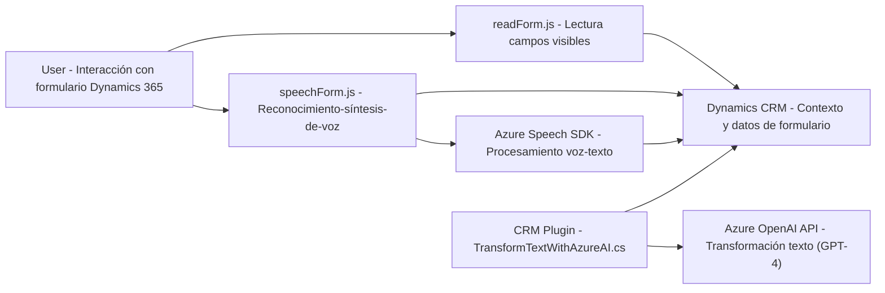

### Resumen técnico

Este conjunto de archivos representa una solución integrada para la interacción y manejo de datos en formularios de **Dynamics 365**. Los tres archivos (frontend con **Javascript** y backend con **C#**) están enfocados en extender funcionalidades de formularios mediante **Azure Speech SDK**, integración con **Azure OpenAI**, y **Dynamics CRM Plugins**. La solución permite, por ejemplo, entrada y síntesis de voz, procesamiento de transcripciones, y transformaciones de texto mediante IA.

---

### Descripción de arquitectura

La arquitectura combina múltiples capas de integración y procesamiento:
1. **Frontend** (JavaScript): Proporciona herramientas para interacción directa en el entorno de Dynamics 365, procesando voz y texto relacionado con formularios.
2. **Backend** (C# Plugin): Una capa de servicio que conecta Dynamics CRM con Azure OpenAI para procesamiento avanzado de texto.
3. **SOA (Service-Oriented Architecture)**: Los servicios externos (Azure Speech y Azure OpenAI) son utilizados para lógica avanzada fuera de Dynamics 365, convirtiendo fragmentos de la solución en **microservicios funcionales**.
4. **Patrón de sincronización dinámica**: Se utiliza carga condicional del SDK de Speech para minimizar dependencias y optimizar el comportamiento del frontend.
5. **Modelo extensible**: El plugin implementando `IPlugin` permite asociaciones flexibles a eventos de Dynamics CRM.

---

### Tecnologías usadas

1. **Frontend**:
   - **JavaScript** y entornos de navegador.
   - **Azure Speech SDK** para síntesis y reconocimiento de voz.
   - **Dynamics 365 libraries (Xrm.WebApi)** para manejo de formularios y contexto.

2. **Backend**:
   - **C#** y .NET framework.
   - **Azure OpenAI API** (modelo GPT-4 para transformación de texto).
   - `Microsoft.Xrm.Sdk` para integración con Dynamics CRM.

3. **Servicios externos**:
   - Speech SDK (JavaScript).
   - Azure OpenAI (GPT-4).
   - Microsoft Dynamics CRM Plugins.

4. **Patrones usados**:
   - **Encapsulación**: Estructuras bien definidas para separar lógica.
   - **Carga condicional**: Dinámica SDK solo si es necesario.
   - **Service-Oriented Architecture (SOA)**: Conexión a servicios externos evitando procesamiento dentro del sistema anfitrión.

---

### Diagrama Mermaid

---

### Conclusión final

La solución es una implementación robusta y extensible que amplía las capacidades estándar de Dynamics CRM con la ayuda de servicios cognitivos de Azure. Los archivos están diseñados con una estructura modular, incorporan patrones modernos como SOA, y aseguran adaptabilidad a distintas configuraciones de formularios. Sin embargo, podría beneficiarse de una revisión más profunda para abordar posibles problemas en la consistencia del estado contextual cuando varias sesiones intentan acceder simultáneamente al SDK.