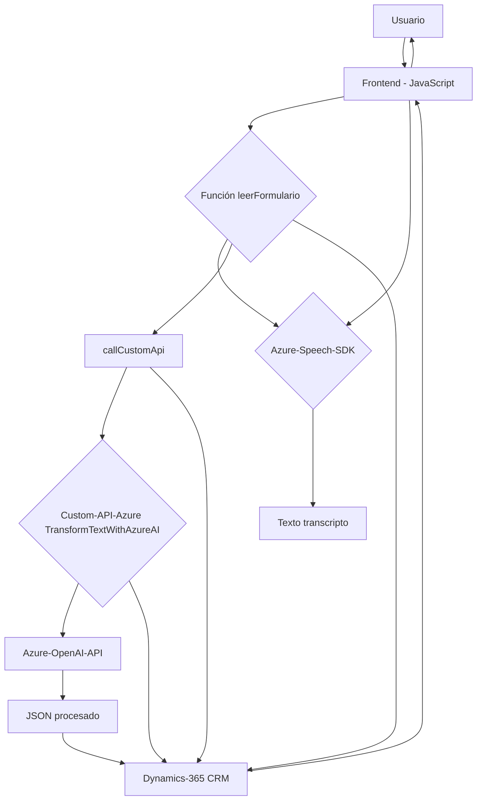

### Breve resumen técnico
El repositorio parece corresponder a una solución que integra varias tecnologías y componentes para ofrecer la funcionalidad de manipulación de datos en un formulario, incluyendo la lectura, actualización y transformación del texto mediante inteligencia artificial y reconocimiento de voz. Utiliza el **Azure Speech SDK** para sintetizar y reconocer voz, la API de Dynamics 365 para manipular el formulario, y una integración con **Azure OpenAI** para transformar texto con IA.

---

### Descripción de la arquitectura
La arquitectura está orientada a la conexión de servicios externos, con una integración entre un frontend (JavaScript) y un backend basado en **Dynamics 365**. Los principales componentes del sistema incluyen:

1. **Frontend**:
   - Scripts de JavaScript que implementan la funcionalidad de lectura y síntesis de voz, así como la transcripción y procesamiento de datos con servicios externos (Azure Speech SDK y Custom API).
   - Mecanismos de actualización de datos en un formulario dinámico.

2. **Backend**:
   - Plugin CRM desarrollado en **.NET** capaz de interactuar con Dynamics CRM para transformar texto basado en reglas utilizando **Azure OpenAI**.

La solución puede clasificarse como una **arquitectura de n capas**:
- **Capa de Presentación**: Frontend en JavaScript que interactúa con el usuario.
- **Capa de Procesamiento**: Código JavaScript que gestiona la lógica de negocio y realiza llamadas a servicios externos (Azure Speech SDK, Custom API).
- **Capa de Procesamiento en Backend**: Plugin CRM en .NET que conecta Dynamics CRM y Azure OpenAI.

---

### Tecnologías usadas
1. **Lenguajes**:
   - **JavaScript**: Implementación del frontend para manejar lógica de voz y datos.
   - **C#**: Desarrollo del plugin CRM.
2. **Frameworks y plataformas**:
   - **Dynamics 365**: Plataforma para el CRM y el manejo del formulario.
   - **Azure Speech SDK**: Para reconocimiento y síntesis de voz.
   - **Azure OpenAI API**: Para procesamiento de texto con IA.
3. **Librerías**:
   - **Newtonsoft.Json** y **System.Text.Json**: Manipulación de JSON en el backend.
4. **Patrones de diseño**:
   - **Plugin Pattern** (CRM plugin).
   - **Service Layer** para el CRUD hacia Dynamics 365 y la integración con Azure OpenAI.
   - **Callback Pattern y Asincronía** en el frontend para garantizar interacciones en tiempo real con los servicios externos.

---

### Diagrama Mermaid

---

### Conclusión final
Este repositorio parece ofrecer una solución híbrida con un fuerte enfoque en la integración de servicios de Microsoft Azure y Dynamics 365. El diseño sigue una arquitectura de **n capas** que separa las responsabilidades, con un uso extensivo de APIs como **Azure Speech SDK** para el procesamiento de voz y una **Custom API** soportada por un plugin de Dynamics 365 que utiliza **Azure OpenAI** para realizar la transformación de texto con IA.

La solución demuestra un uso eficiente de patrones como el **Plugin Pattern**, **Service Layer**, **Callback Pattern**, y otros. Sin embargo, hay un gran grado de acoplamiento en términos de dependencias externas, lo que limita su flexibilidad y potencia el riesgo de fallos ante problemas en dichas integraciones. De igual manera, parece ser una arquitectura adecuadamente diseñada para sistemas que operen dentro de soluciones de Dynamics 365 donde las dependencias externas están controladas por el mismo proveedor (Microsoft Azure).