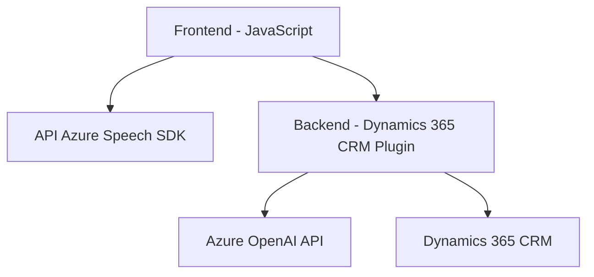

# Breve resumen técnico

El código en los archivos parece ser parte de una solución con integración entre un **frontend web** y la plataforma **Dynamics 365 CRM**. Incluye funcionalidad para interacción por voz mediante **Azure Speech SDK** y gestión de contenido en CRM con ayuda de un **plugin** que utiliza **Azure OpenAI** para procesar datos.

---

# Descripción de arquitectura

La arquitectura es **n capas**, donde cada capa tiene una responsabilidad específica:
1. **Frontend:** Implementa manejo de voz con funciones organizadas modularmente, usando Azure Speech SDK.
2. **Backend CRM (Plugin):** Amplía las funcionalidades del Dynamics 365 CRM con un plugin que utiliza Azure OpenAI para procesamiento inteligente.

Las responsabilidades están separadas en tres capas principales:
- **Presentación:** Archivos frontend (`readForm.js`, `speechForm.js`) que manejan la interacción con el usuario mediante voz.
- **Lógica de negocio:** Plugins (`TransformTextWithAzureAI.cs`) que ejecutan transformación avanzada en el backend.
- **Acceso a datos:** Integración con APIs externas como Azure Speech y OpenAI para procesamiento y síntesis.

Patrones identificados:
- **Modularidad:** Separación de funcionalidades en funciones pequeñas y reutilizables.
- **Fachada:** Funciones como `startVoiceInput` y `execute` encapsulan procesos complejos detrás de una interfaz sencilla.
- **Delegación:** Cada función y clase cumple una responsabilidad específica.
- **Integración externa:** Uso de APIs como Azure Speech SDK y OpenAI.

---

# Tecnologías usadas

1. **Frontend:**
   - **JavaScript:** Lenguaje principal en los archivos frontend.
   - **Azure Speech SDK:** Proporciona síntesis y reconocimiento de voz.
   - **DOM API:** Dinámica de carga del SDK.

2. **Backend:**
   - **Dynamics 365 CRM SDK:** Herramientas para extender funcionalidades del CRM.
   - **Azure OpenAI:** Servicio externo para procesamiento de texto mediante inteligencia artificial.
   - **Newtonsoft.Json:** Manipulación avanzada de JSON.
   - **System.Net.Http:** Comunicación HTTP con APIs externas.

3. **Arquitectura de servicios:** Comunicaciones libres entre frontend y backend mediante las APIs de Azure.

---

# Diagrama Mermaid

---

# Conclusión final

Esta solución combina funcionalidades de **frontend web** interactivo con síntesis de voz, conectadas a un CRM extendido mediante **plugins backend**. Utiliza APIs de Azure (Speech SDK y OpenAI) para ofrecer un flujo de trabajo eficiente con procesamiento de voz y datos inteligente. La arquitectura está bien organizada, priorizando la separación de responsabilidades mediante el patrón n capas. Es una solución avanzada indicada para proyectos de automatización empresarial o asistencia interactiva.