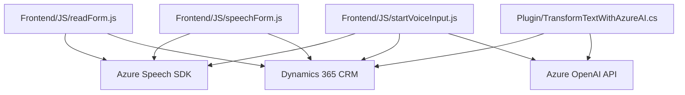

### Breve resumen técnico:
Este repositorio combina funcionalidades frontend en **JavaScript** y plugins backend en **C#**, integrándose con servicios externos como **Azure Speech SDK** y **Azure OpenAI API** para convertir texto de formularios en voz, realizar reconocimiento de voz y transformar texto mediante IA. La solución está diseñada para interactuar con formularios de **Dynamics 365**, utilizando tanto servicios de terceros como APIs integradas al CRM.

### Descripción de arquitectura:
La solución tiene una arquitectura **híbrida** basada en:
1. **Frontend**: Modularidad y funcionalidad asíncrona (JS) con integración al SDK de Azure para reconocimiento y síntesis de voz.
2. **Backend**: Plugins extendidos de Dynamics 365 usando **C#** y el patrón **Plugin**.
3. Uso de servicios externos mediante APIs REST.
4. **Patrones**:
   - Integración de servicios externos.
   - Lazy loading en el frontend.
   - Transformación de datos y llamadas asincrónicas.

### Tecnologías usadas:
1. **Frontend**:
   - **JavaScript** con integración a servicios distribuidos.
   - **Azure Speech SDK** para síntesis y reconocimiento de voz.
   - APIs para modificar formularios dinámicos en entornos CRM.
2. **Backend**:
   - **C#** librerías específicas del SDK de Dynamics 365 (Microsoft.Xrm.Sdk y IPlugin).
   - REST APIs para interactuar con **Azure OpenAI** (GPT).
3. Externals:
   - **Azure Speech SDK**: Convertir texto en voz en español y realizar transcriptos en tiempo real.
   - **Azure OpenAI API**: Procesar texto con GPT.
4. Estándares:
   - JSON para transmisión de datos entre sistemas.
   - REST/HTTP.

### Dependencias o componentes externos:
1. **Azure Speech SDK** para operaciones relacionadas con voz.
2. **Azure OpenAI API** para transformación de texto.
3. **Dynamics 365 SDK** para realizar operaciones sobre entidades del CRM.
4. **Newtonsoft.Json** o **System.Text.Json** para procesamiento JSON en **TransformTextWithAzureAI.cs**.
5. **HTTPClient** en C# para realizar las solicitudes a Azure OpenAI.

---

### Diagrama Mermaid válido:

---

### Conclusión final:
El repositorio implementa una solución combinada de **frontend** y **backend** que extiende las capacidades de **Dynamics 365** utilizando servicios avanzados de Azure, como Speech SDK y OpenAI API. Está diseñado bajo una estructura modular y centrada en la integración de servicios externos, siguiendo patrones comunes de arquitectura para sistemas distribuidos. Su implementación está bien segmentada entre la generación de voz en frontend y el procesamiento de texto en backend. Sin embargo, el código puede mejorarse para manejar configuraciones de credenciales de forma más segura y emplear pruebas más robustas frente a excepciones.