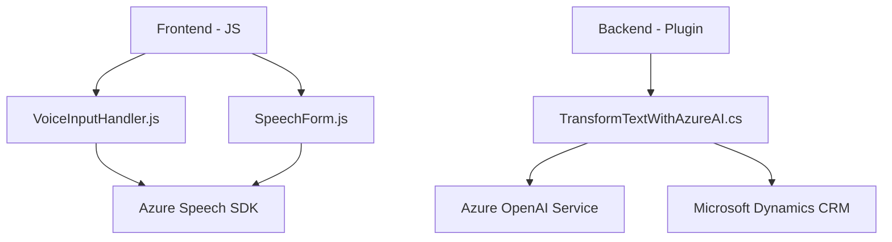

### Breve resumen técnico
El repositorio integra funcionalidades avanzadas para interactuar y procesar datos de formularios, utilizando **reconocimiento de voz**, **síntesis de texto a voz**, y **transformación de datos con inteligencia artificial (IA)**. Los archivos detallados describen componentes centrados en el frontend (JavaScript) y en el backend (Microsoft Dynamics Plugin), conectados a servicios de Azure y Microsoft Dynamics CRM.

---

### Descripción de arquitectura
- **Frontend**: Se organiza alrededor de módulos JavaScript que permiten captura de voz y interacción contextual con formularios dinámicos mediante el **Azure Speech SDK**. Aplica patrones de programación orientados a eventos y modularización.
- **Backend**: El plugin desarrollado para **Dynamics CRM** expande las capacidades del sistema mediante lógica extensible para procesar texto con **Azure OpenAI (GPT)**. Implementa los estándares del modelo de extensibilidad de CRM (`IPlugin`).
- **Arquitectura general**: Se puede considerar una **arquitectura de capas** en conjunto, donde:
  - **Frontend**: Actúa como capa cliente que consume servicios externos y datos operativos.
  - **Backend (CRM Plugin)**: Funciona como capa intermedia y controladora de lógica de negocio, interactuando con Azure.

---

### Tecnologías usadas
1. **Frontend**:
   - **JavaScript**: Proporciona lógica del cliente y manipulación del DOM.
   - **Azure Speech SDK**: Reconocimiento y síntesis de voz.
2. **Backend**:
   - **C# (.NET)**: Lenguaje para desarrollo del plugin Dynamics CRM.
   - **Microsoft Dynamics SDK**: Framework para extender funcionalidades del CRM.
   - **Azure OpenAI Service**: Procesamiento de texto mediante GPT.
3. **Servicios externos**:
   - **Azure Cognitive Services**: Conexión con APIs de reconocimiento y síntesis de voz.
   - **HTTP REST API**: Integración de servicios web para datos procesados.

---

### Diagrama Mermaid válido para GitHub

---

### Conclusión final
El repositorio combina funcionalidades avanzadas con servicios gestionados en el contexto de Microsoft Dynamics. Es evidente que se usa una arquitectura orientada a capas, con una separación clara entre el cliente (frontend) y el servidor (backend). Destaca el uso de API de Azure para reconocimiento y procesamiento de voz, junto al consumo de OpenAI para transformaciones textuales. El sistema resulta altamente extensible y modular, adecuado para soluciones empresariales que requieran interacción dinámica por voz y procesamiento inteligente de datos.

Este diseño representa una integración ejemplar de inteligencia artificial y sistemas empresariales en un entorno modular, escalable y centrado en el cliente.