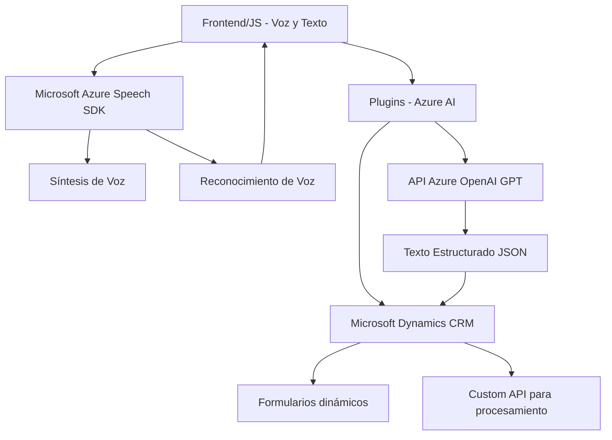

### Breve resumen técnico
El repositorio presenta un sistema que permite interactuar con formularios utilizando síntesis de voz y reconocimiento de voz mediante Microsoft Azure Speech SDK, junto con procesamiento de texto mediante la integración con una API de Azure OpenAI. Está diseñado para aplicaciones relacionadas con accesibilidad y automatización en entornos corporativos como Dynamics CRM.

---

### Descripción de la arquitectura
La arquitectura del sistema es modular, basada en una combinación de los siguientes elementos:
1. **N-Capas**: Existe una clara separación entre capas de presentación (`Frontend/JS`), capa de servicios (`Plugins/TransformTextWithAzureAI.cs`) y capa de datos (interacción con APIs y salida estructurada).
2. **Cliente/Servidor**: Se utiliza una lógica que separa la interacción del cliente (captura de voz, formularios dinámicos) y procesamiento del servidor (Azure Speech SDK y OpenAI).
3. **Integración con microservicios externos**: Se realizan llamadas externas a Microsoft Azure Speech (gestión de síntesis y reconocimiento de voz) y Azure OpenAI para procesar texto.
   
El código también aplica patrones de diseño como:
- **Loader** para importar el Microsoft Azure Speech SDK dinámicamente.
- **Encapsulación** para segmentar funcionalidad dentro de funciones específicas (p. ej., extracción de datos visibles, mapeo de campos).
- **Plugin-based Architecture** en el contexto de Dynamics CRM.

---

### Tecnologías utilizadas
1. **Frontend**: 
   - JavaScript → Para la posible interfaz interactiva y lógica de negocio del cliente.
   - Microsoft Azure Speech SDK → Para síntesis y reconocimiento de voz.
   - API Dynamics (Xrm.WebApi) → Integración directa con entidades en el sistema de Microsoft Dynamics CRM.
   
2. **Backend**: 
   - C# → Desarrollo del plugin como un servicio interno en Dynamics CRM.
   - Microsoft.Xrm.Sdk → Interacción con entidades CRM.
   - Azure OpenAI → Procesamiento avanzado de texto con modelos GPT.
   - Newtonsoft.Json → Para la manipulación de datos JSON en el backend.
   - System.Net.Http → Realización de solicitudes HTTP hacia la API de Azure.

3. **Servicios externos**:
   - **Azure Speech SDK**: Funcionalidades avanzadas de voz (síntesis, reconocimiento).
   - **Azure OpenAI GPT API**: Generación de contenido estructurado a partir de texto libre.

---

### Diagrama Mermaid válido para GitHub

---

### Conclusión final
Este repositorio implementa una solución integral que combina varias tecnologías para interactuar con formularios en el contexto de Microsoft Dynamics CRM. La arquitectura sigue principalmente el modelo N-capas, integrando servicios externos de Azure Speech y OpenAI para habilitar un flujo avanzado de accesibilidad y automación. La documentación técnica es clara y permite entender las dependencias y características del sistema rápidamente. Sin embargo, sería recomendable optimizar la seguridad de las claves de servicio mediante configuraciones más dinámicas y revisar importaciones innecesarias para garantizar eficiencia en el código.