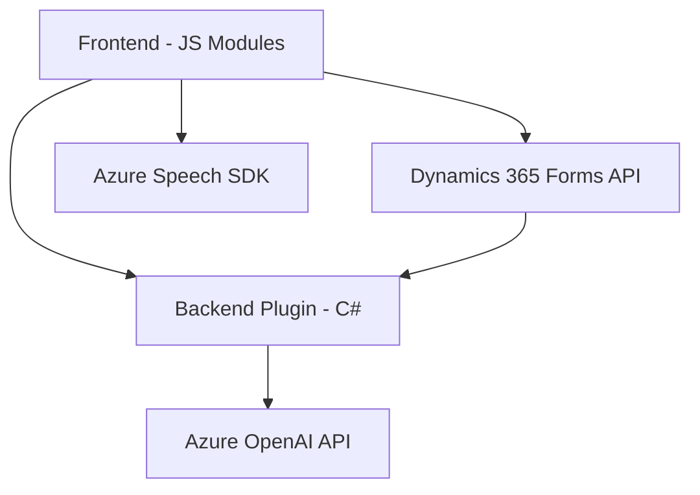

### Breve resumen técnico:

El repositorio contiene archivos que implementan funcionalidades relacionadas con la interacción entre usuarios y formularios (entrada y salida de datos vía voz y texto), además de un plugin que conecta Dynamics CRM con Azure OpenAI para el procesamiento avanzado de texto. Las tecnologías integradas incluyen SDK de Azure Speech, Azure OpenAI API, y servicios de Microsoft Dynamics CRM.

---

### Descripción de arquitectura:

1. **Tipo de solución**: La solución es una combinación de funcionalidades para una API y un frontend de formularios relacionados con **Dynamics CRM**. Los componentes principales permiten:
    - Entrada y salida accesible (via voz y sintetización) en formularios.
    - Procesamiento avanzado de transcripciones con reglas y mapeo de campos.
    - Conexión a servicios externos (Azure Speech SDK, OpenAI).

2. **Tipo de arquitectura**:
   - **Capa de presentación (frontend)**: Implementa módulos para interactuar con formularios de Dynamics CRM a través de voz (entrada y salida de datos).
   - **Capa lógica y servicios (backend/plugin)**: Un plugin personalizado (`TransformTextWithAzureAI`) utiliza arquitectura basada en la integración con Azure OpenAI para procesar reglas específicas con HTTP APIs.
   - **Arquitectura general**: Una solución en **n-capas**, donde cada capa tiene responsabilidades definidas (presentación, lógica, integración, API).

---

### Tecnologías usadas:

1. **Frontend**:
   - JavaScript.
   - Azure Speech SDK para entrada de voz y síntesis (cargado vía URL externa).
   - Dynamics 365 Forms API para manipulación/formularios.

2. **Backend y Plugins**:
   - **Microsoft Dynamics SDK**:
     - `IPlugin` para extender funcionalidades de Dynamics CRM.
     - `IOrganizationService` para operaciones de datos en la plataforma.
   - **Azure OpenAI API**:
     - Transformación inteligente de texto usando un endpoint externo.
   - **Dependencias .NET**:
     - `Newtonsoft.Json` (JSON interactivo).
     - `System.Net.Http` (Azure API Requests).

3. **Patrones**:
   - Modular: Funciones autónomas que realizan tareas específicas como síntesis o reconocimiento.
   - Asíncrono: Promesas y manejo de callbacks para integraciones dinámicas.
   - Integración de SDK/API: Conexiones a Azure Speech y OpenAI mediante HTTP.

---

### Dependencias y componentes externos:

1. **Externas**:
   - **Azure Speech SDK**: Para la interacción de voz.
   - **Azure OpenAI API**: Para transformación de texto e IA.
   - **Dynamics 365 Forms API**: Para manipulación interna de formularios.

2. **Internas**:
   - Módulos propios como `startVoiceInput.js` y `speechForm.js` para front-facing dynamics.
   - Métodos como `applyValueToField()` para lógica de transformación entre formularios y datos.

---

### Diagrama Mermaid:

---

### Conclusión Final:

La solución depende de una arquitectura **n-capas** que integra tanto lógica para la presentación mediante JavaScript como una capa de plugins desarrollada en C#. Su objetivo es enriquecer la accesibilidad de los formularios en Dynamics CRM, ofreciendo tanto entrada por reconocimiento de voz como salida por síntesis de voz. Además, incorpora procesamiento avanzado de texto a través de Azure OpenAI, lo que posiciona a esta solución como un ejemplo robusto de integración de servicios en la nube.