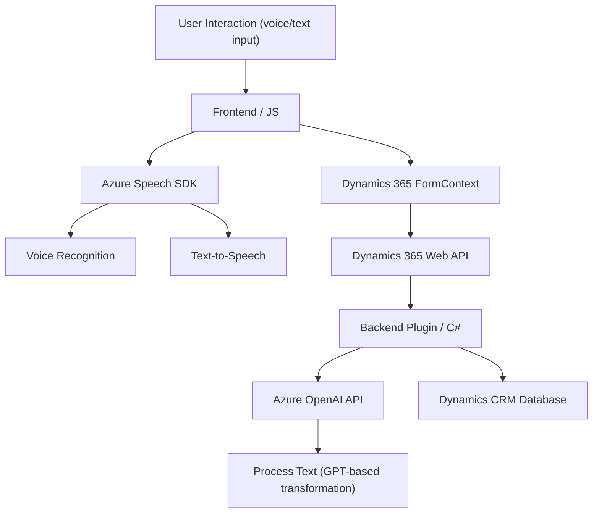

### Breve resumen técnico
El repositorio representa una solución destinada principalmente a implementar funcionalidad de interacción por voz y procesamiento de datos en un entorno Dynamics 365. Utiliza extensiones frontend basadas en JavaScript para enriquecer el sistema con soporte de reconocimiento de voz y síntesis de texto a voz, además de un plugin en C# para procesar texto mediante Azure OpenAI.

### Descripción de arquitectura
La solución está dividida en varias capas:
- **Frontend:** Contiene funciones en JavaScript para interacción con Dynamics 365 y para integrar la funcionalidad de Azure Speech SDK (entrada de voz y síntesis de voz).
- **Backend:** Incluye un plugin desarrollado en C# para extender la funcionalidad de Dynamics CRM mediante el procesamiento de texto con Azure OpenAI.
- **Servicios externos:** Azure Speech SDK y Azure OpenAI se integran para reconocimiento de voz, síntesis de voz y procesamiento avanzado de lenguaje natural (GPT o similar).
  
El diseño global es modular, adoptando un enfoque **n-capas** y patrones se adaptan a servicios API para integración externa.

### Tecnologías usadas
1. **Frontend:**
   - **JavaScript** es el lenguaje principal para la interacción con los formularios y SDK.
   - Usa Azure Speech SDK para reconocimiento de voz y síntesis de texto a voz.
   - Dynamics 365 Web API para integración con formularios y datos.

2. **Backend:**
   - **C#** para el desarrollo del plugin en Dynamics CRM.
   - **Newtonsoft.Json** y `System.Text.Json` para manejo de estructuras JSON.
   - **Azure OpenAI API** para procesamiento de lenguaje natural (NLP).

### Dependencias o componentes externos
1. **Azure Speech SDK:** Utilizado en el frontend para reconocimiento de voz y síntesis de voz.
2. **Azure OpenAI:** Utilizado en el plugin para procesamiento avanzado de texto basado en GPT (inteligencia artificial).
3. **Dynamics 365 APIs y SDKs:** Para manipulación y extensión de datos y formularios en Dynamics CRM.
4. **Bibliotecas JSON:** Para trabajo con datos estilo JSON en C#.

### Diagrama Mermaid

### Conclusión final
La solución tiene una arquitectura **n-capas**, con cada capa claramente definida para cumplir su propia responsabilidad:
- **Frontend:** Proporciona una interfaz para habilitar interacción por voz con Dynamics 365 y facilita la síntesis de texto a voz utilizando Azure Speech SDK.
- **Backend Plugin:** Amplía las capacidades de Dynamics CRM procesando el texto con servicios de inteligencia artificial como Azure OpenAI. Este plugin sigue el patrón de diseño de Dynamics CRM (plugin) para integrarse de forma eficiente.

La integración con servicios externos como Azure Speech SDK y Azure OpenAI muestra un enfoque moderno, aprovechando tecnologías de nube y APIs para proporcionar una experiencia de usuario más rica. Esta solución es modular, escalable y puede adaptarse para entornos empresariales multilingües.