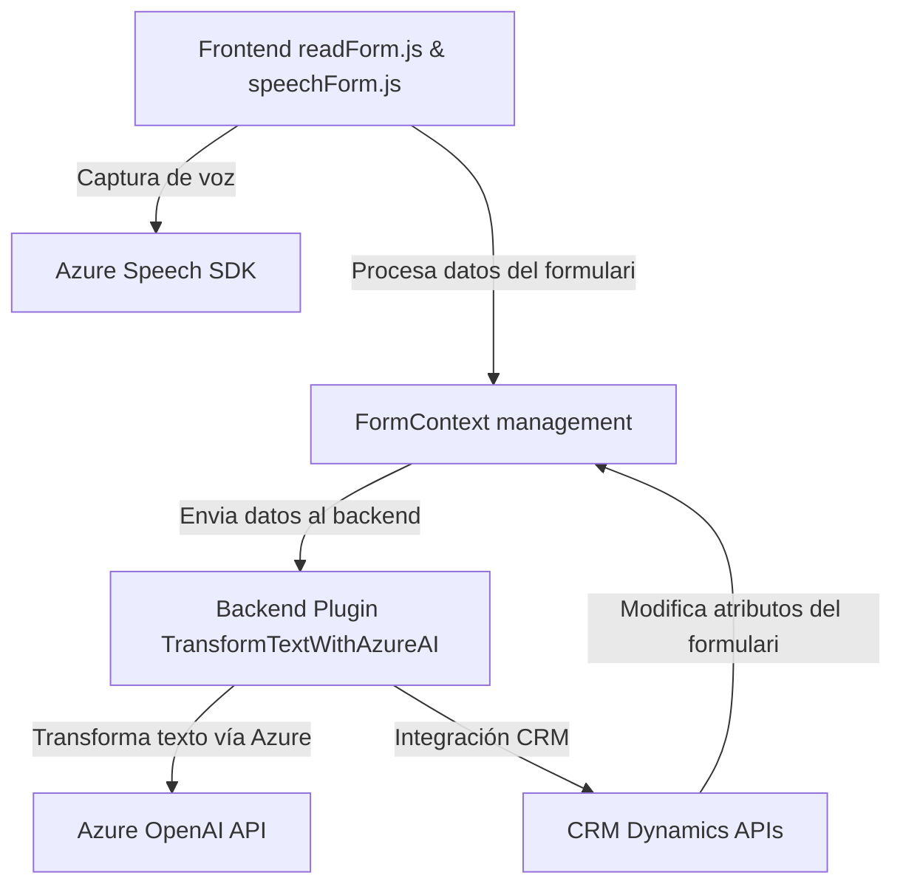

### Breve Resumen Técnico
Este repositorio consta de tres archivos principales que implementan una solución que integra funcionalidades de reconocimiento de voz, síntesis de voz y procesamiento de texto, diseñada para aplicaciones en entornos empresariales, como Dynamics CRM. La solución utiliza el **Azure Speech SDK** y **Azure OpenAI API** para los servicios de voz e inteligencia artificial respectivamente.

### Descripción de Arquitectura
La solución está estructurada en tres niveles:
1. **Frontend con JavaScript**: Archivos `readForm.js` y `speechForm.js` manejan interacciones de voz y formularios en el navegador, integrando capacidades del **Azure Speech SDK**. También transforman datos para integración con el backend, como procesamiento y asignación de valores a formularios de CRM.
2. **Backend (Dynamics CRM)**: Archivo `TransformTextWithAzureAI.cs` implementa un plugin en C# para Dynamics CRM que interactúa con la API de Azure OpenAI para transformar texto en estructuras JSON útiles dentro del sistema CRM.
3. **Servicios Externos**: Dependencia directa de APIs de **Azure Speech** y **Azure OpenAI**, utilizadas tanto en el frontend (reconocimiento y síntesis de voz) como en el backend (procesamiento de texto).

La arquitectura general puede clasificarse como **n capas**:
- **Capa de presentación**: Archivos frontend procesan datos y actúan como puente entre usuarios y la funcionalidad.
- **Capa lógica de negocio**: Implementada en el plugin de Dynamics CRM, donde se gestiona el procesamiento por IA.
- **Capa de servicio externo**: Servicios de Azure gestionan tareas relacionadas con voz e IA.

Además, se observa integración mediante el patrón **event-driven programming** (callbacks y notificaciones) y uso de adaptadores para convertir datos entre distintos formatos.

### Tecnologías Usadas
1. **JavaScript**: En los archivos frontend (`readForm.js` y `speechForm.js`), complementado con callbacks y funciones asincrónicas.
2. **Azure Speech SDK**: Servicios de reconocimiento y síntesis de voz, cargados dinámicamente en el frontend.
3. **Azure OpenAI API**: Procesamiento de texto avanzado, conectando el backend al servicio.
4. **Dynamics CRM SDK**: Gestión del ciclo de vida de eventos del CRM mediante plugins en C#.
5. **C#**: Implementación en el plugin `TransformTextWithAzureAI.cs`, con soporte para APIs externas y procesamiento de datos.
6. **HTTP APIs**: Comunicación con servicios Azure mediante solicitudes `POST`.

### Diagrama Mermaid válido para GitHub

### Conclusión Final
Esta solución es un ejemplo sólido de integración de tecnologías modernas (Azure Speech y OpenAI) con plataformas empresariales como Dynamics CRM. La arquitectura **n capas** permite una separación clara entre la gestión de la presentación (frontend), lógica de negocio (backend), y servicios externos. El uso de patrones como **event-driven programming** y adaptadores asegura una interacción fluida entre los componentes. La implementación está diseñada para proporcionar accesibilidad mediante comandos de voz y procesamiento avanzado de texto estructurado.