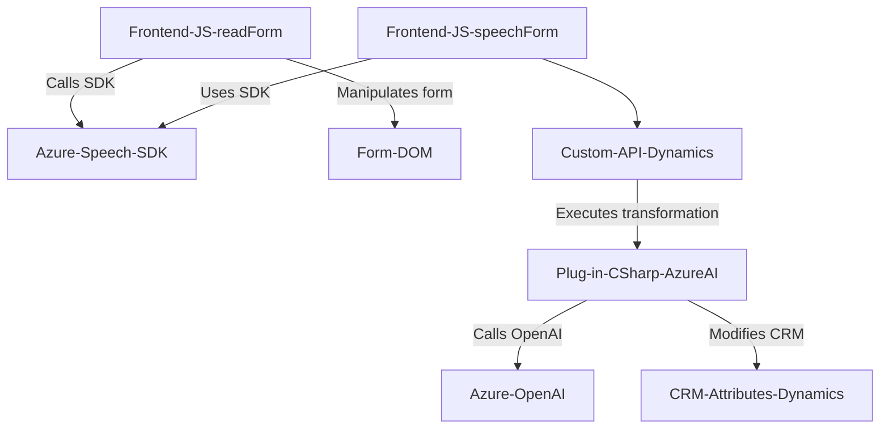

### Breve resumen técnico

El repositorio contiene archivos que combinan funcionalidades para procesar datos de formularios en un entorno Microsoft Dynamics CRM, integrar reconocimiento de voz y sintetización a través del **Azure Speech SDK**, y ejecutar transformaciones de texto con **Azure OpenAI** integrado en un plugin. El diseño incluye un frontend basado en JavaScript para la interacción en formularios y un backend escrito en C# mediante un plugin de Dynamics CRM.

---

### Descripción de arquitectura

La arquitectura de esta solución puede clasificarse como **monolítica multiservicio**, dado que presenta una separación lógica entre el frontend (JavaScript) y el backend (plugin en C#), pero todos los componentes están interconectados dentro del ecosistema de Dynamics CRM. Operan bajo el patrón **n capas**, con capas de presentación (frontend), lógica de negocio (script y plugins integrados), y acceso a servicios externos (Azure Speech SDK y OpenAI).

Patrones clave detectados:
1. **Lógica orientada a eventos y programación asíncrona:** En los scripts, el uso de callbacks y promesas garantiza el flujo secuencial de tareas.
2. **Uso de plugins extensibles:** El plugin implementa una interfaz estándar `IPlugin`, siguiendo el modelo de extensiones de Dynamics CRM.
3. **Integración con cloud computing:** Dependencia explícita de servicios de Azure (Speech SDK y OpenAI).

---

### Tecnologías usadas

1. **Frontend (JavaScript):**
   - JavaScript (ES6).
   - **Azure Speech SDK**: Reconocimiento de voz y síntesis de texto a audio.
   - **DOM APIs**: Manipulación dinámica de formularios.
   - Promises y callbacks para ejecución asincrónica.

2. **Backend (C# Plugin):**
   - **Microsoft Dynamics CRM SDK**: Extensión del ecosistema CRM mediante el patrón plugin.
   - **System.Net.Http**: Conexión con APIs externas.
   - **Azure OpenAI Service**: Procesamiento de texto con modelos de lenguaje GPT.
   - **JSON Manipulation**: Gestión de objetos JSON mediante `System.Text.Json` y `Newtonsoft.Json.Linq`.

3. **Integración con servicios externos:**
   - **Azure Speech SDK** (Frontend): Facilita reconocimiento de voz y generación de audio.
   - **Azure OpenAI** (Plugin): Procesa texto según reglas definidas para generar formatos específicos de transformación.

---

### Diagrama Mermaid válido para GitHub

---

### Conclusión final

Esta solución representa una combinación eficiente entre un frontend en **JavaScript** y un backend basado en servicios de **Dynamics CRM** con complementos en **C#**. Está diseñada para proporcionar una interfaz interactiva de formularios mediante entrada/salida de voz (Azure Speech SDK), mientras que la lógica de negocio avanza hacia la inteligencia artificial para transformar y optimizar datos a través de **Azure OpenAI**. El diseño favorece la separación de responsabilidades por capas, pero al estar dentro de un ecosistema central (Dynamics CRM), sigue siendo un monolito extendido con servicios externos. Con actualizaciones adecuadas, podría transicionar hacia una arquitectura más distribuida o basada en microservicios si se externalizan componentes clave como los scripts o plugins.