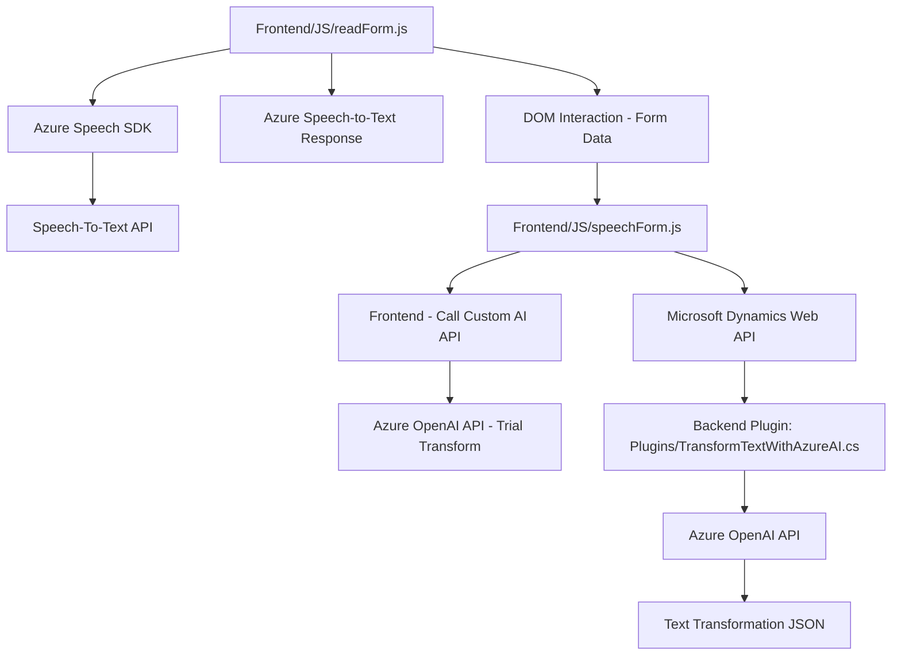

### Breve resumen técnico

El repositorio define tres archivos significativos: dos relacionados con un frontend basado en JavaScript para la interacción con formularios mediante voz, y uno dirigido a la integración de un plugin en Microsoft Dynamics CRM. Los archivos trabajan en conjunto para proporcionar capacidades de reconocimiento de voz, síntesis de texto en voz, y procesamiento de texto avanzado usando servicios de Microsoft Azure.

---

### Descripción de arquitectura

1. **Tipo de solución**: Esta solución consta de:
   - **Frontend web**: Interfaz orientada al procesamiento de formularios mediante comandos de voz integrados con Azure Speech SDK.
   - **Backend Plugin**: Lógica con Microsoft Dynamics CRM para procesar datos con Azure OpenAI.
2. **Arquitectura**: 
   - **N capas**: La solución separa el código en módulos bien definidos: capa de frontend (JS) para interacción de voz, y capa de backend (C#) para procesamiento de texto y datos.
   - **Patrón cliente-servidor**: El frontend invoca tanto al Azure Speech SDK como al plugin desarrollado en C#, que actúa como integrador con Microsoft Dynamics y OpenAI.

---

### Tecnologías usadas

1. **Frontend**
   - JavaScript ES6+.
   - Azure Speech SDK (cargado dinámicamente desde URL).
   - Manipulación del DOM.
   - Promesas y funciones asíncronas (`async/await` para gestión de flujos asíncronos).

2. **Backend Plugin**
   - Microsoft Dynamics CRM SDK.
   - Azure OpenAI API.
   - .NET Core Framework.
   - JSON handling (`System.Text.Json` y `Newtonsoft.Json`).

---

### Dependencias y componentes externos

1. **Azure Speech SDK**: Integrado en el frontend para reconocimiento del habla y síntesis de texto a voz.
2. **Microsoft Dynamics CRM SDK**: Utilizado para la comunicación entre el plugin y el sistema CRM.
3. **Azure OpenAI API**: Servicios de procesamiento de lenguaje natural y generación de JSON.

---

### Diagrama Mermaid

A continuación, el diagrama **Mermaid**, que representa cómo se conectan los diferentes componentes de la solución y las dependencias asociadas:

---

### Conclusión final

La solución presentada hace uso de tecnologías modernas alineadas con la integración de servicios Cloud, como lo son Azure Speech SDK y Azure OpenAI API. El frontend es modular y emplea un enfoque basado en funciones bien encapsuladas, siguiendo principios de programación funcional y cliente-servidor. El backend implementa un plugin eficiente para Microsoft Dynamics CRM que conecta de forma robusta con Azure OpenAI para procesamiento avanzado de texto.

El sistema está diseñado bajo una arquitectura **n capas**, brindando una separación de preocupaciones entre el frontend web y el plugin backend. Esto facilita el mantenimiento futuro, la posibilidad de escalar y la integración con otros sistemas y APIs.