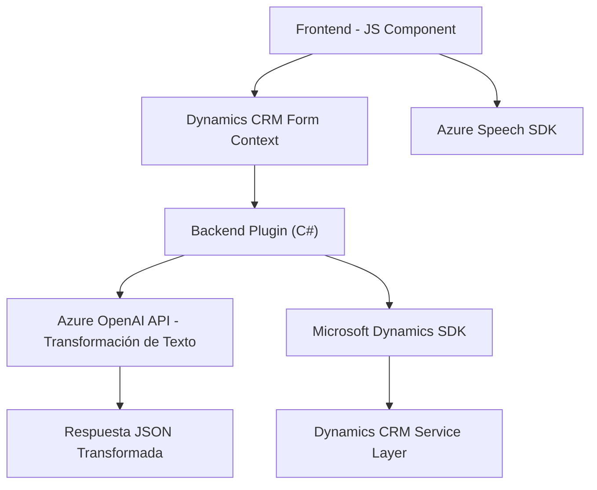

### Breve Resumen Técnico:
El repositorio contiene componentes de frontend en JavaScript específicamente orientados a la interacción con formularios mediante entrada y salida de voz, además de un plugin en C# que conecta Microsoft Dynamics CRM con la API de Azure OpenAI para realizar transformaciones de texto.

---

### Descripción de la Arquitectura:
La solución tiene una arquitectura híbrida basada en **modularización de funciones** para tareas específicas. Los componentes de frontend tienen patrones **orientados a servicios**, integrándose con APIs externas (Azure Speech SDK y APIs personalizadas). Los plugins en C# implementan una **arquitectura basada en plugins** para CRM Dynamics y establecen una conexión tipo **API Gateway** con Azure OpenAI.

Aunque no cumple estrictamente con la definición de microservicios, sí aprovecha la idea de integración con servicios externos y división funcional, siendo una aplicación orientada a servicios (SOA).

---

### Tecnologías Utilizadas:
1. **Frontend:**
   - JavaScript (para manipulación de formularios y flujo de voz).
   - SDK de Azure Speech para funciones de síntesis y reconocimiento de voz.
   - Lazy loading para cargar el SDK dinámicamente.

2. **Backend (Plugin con C#):**
   - Microsoft Dynamics SDK (`Microsoft.Xrm.Sdk`) para personalización.
   - Azure OpenAI API para transformación de texto.
   - `System.Net.Http` y `System.Text.Json`/`Newtonsoft.Json.Linq` para comunicación con APIs y manejo de JSON.

3. **Otros Patrones:**
   - Lazy Loading (carga condicional de SDK).
   - Responsabilidad Única: Funciones diseñadas para tareas específicas.
   - Modularización de código tanto en frontend como backend.

---

### Diagrama Mermaid:

Este diagrama muestra los componentes de la solución y sus interacciones.

---

### Conclusión Final:
La solución presenta una arquitectura basada en servicios (SOA) integrada con APIs externas (Azure Speech y Azure OpenAI) y tiene como objetivo automatizar tareas en formularios de Dynamics CRM mediante entrada y salida de voz, además de realizar transformaciones avanzadas de texto. La propuesta se adapta bien a escenarios de automatización e interacción dinámica en sistemas CRM.

Se destacan buenas prácticas como modularización, uso de Lazy Loading y estructuras orientadas a servicios. Sin embargo, tiene una dependencia directa de SDKs externos, la cual puede presentar desafíos en términos de mantenimiento ante cambios en las API.