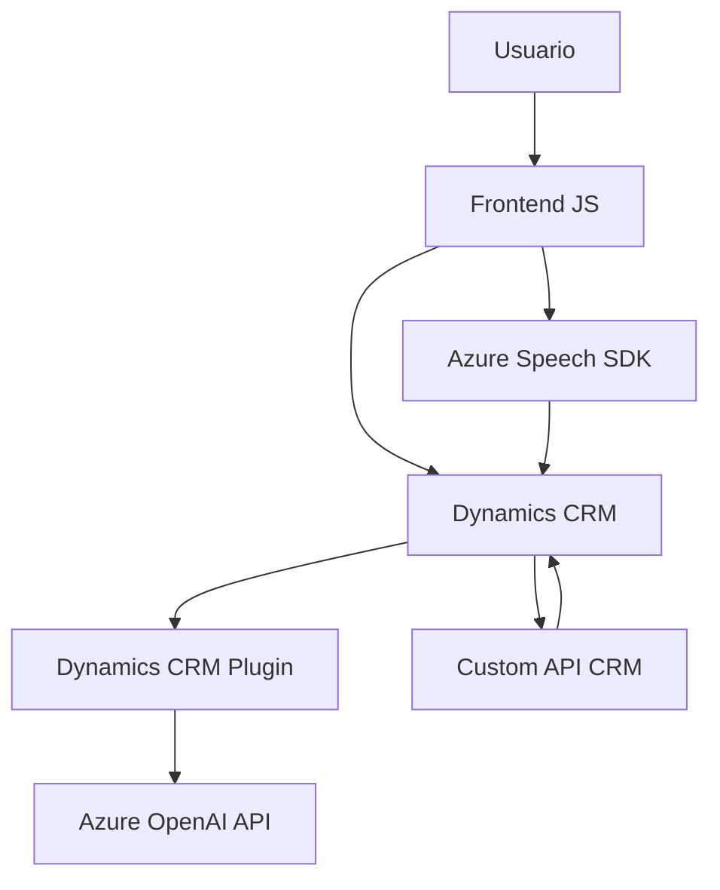

### Breve resumen técnico:

Este repositorio está estructurado para manejar accesibilidad y entrada dinámica por voz en un sistema CRM basado en Dynamics (Microsoft Dynamics CRM). Los archivos están divididos en módulos que implementan reconocimiento de voz, procesamiento de texto, síntesis de voz, y transformación de datos con inteligencia artificial mediante Azure OpenAI.

---

### Descripción de arquitectura:

La solución integra tres niveles:
1. **Frontend:** Contiene funcionalidades en JavaScript para síntesis y reconocimiento de voz mediante Azure Speech SDK. Procesa datos en formularios y actualiza valores dinámicamente.
2. **Plugins:** Implementación en C# para extensiones altamente específicas que interactúan directamente con Dynamics CRM y servicios externos como Azure OpenAI.
3. **Servicios remotos:** Utilización del SDK y servicios de Azure (Speech y OpenAI) para tareas especializadas como generación de JSON estructurado basado en IA.

### Arquitectura identificada:
- **Arquitectura n-capas (layered architecture):** Los módulos definen capas claramente diferenciadas:
  - **Capa de presentación:** El frontend maneja la interacción visual y voz, delegando solicitudes al backend.
  - **Capa lógica:** Plugins en C# ejecutan transformaciones y lógica avanzada utilizando OpenAI.
  - **Capa de integración:** Comunicación HTTP entre el CRM y Azure para reconocimiento de micrófono, transformación de texto, y síntesis de voz.
- **Patrones utilizados:** Delegación dinámica, desacoplamiento en servicios externos (Azure SDKs), y modularidad orientada a funciones específicas.

---

### Tecnologías usadas:

1. **Frontend:**
   - **JavaScript.**
   - **Azure Speech SDK:** Texto a voz y reconocimiento de voz.
   - **Dynamics CRM Context APIs:** Procesa datos de formulario en Dynamics.

2. **Backend/Plugins:**
   - **C#:** Implementación de plugins personalizados.
   - **Azure OpenAI:** Transformación de texto en JSON inteligente.
   - **Dynamics CRM SDK:** Servicios relacionados con atributos del formulario.

3. **Patrones de diseño:**
   - **Lazy Loading:** Carga del Speech SDK cuando es necesario.
   - **Factory Pattern:** Creación de objetos configurados en Azure Speech y OpenAI.
   - **Encapsulación:** Modularización de funcionalidades en funciones y métodos específicos.
   - **Integración de microservicios:** Plugins consumen servicios externos para lógica avanzada (ej. OpenAI).

---

### Dependencias o componentes externos:

- **Azure Speech SDK:** Manejo de voz a texto y texto a voz.
- **Azure OpenAI API:** Transformación avanzada de texto con IA en JSON estructurado.
- **Dynamics CRM APIs:** Actualización y manipulación de formularios y registros contextuales.
- **Newtonsoft.Json:** Manejo de objetos JSON en C#.
- **System.Net.Http:** Realiza solicitudes HTTP desde el backend hacia Azure OpenAI.

---

### Diagrama Mermaid:

---

### Conclusión final:

La solución está diseñada para mejorar accesibilidad en un sistema CRM al integrar acceso por voz, transcripción, procesamiento avanzado con IA, y manipulación directa de datos en formularios dinámicos. Presenta una arquitectura modular y escalable, dividida en capas de presentación (JS), lógica (plugins en C#), y servicios remotos (Azure). Usa patrones de diseño orientados a modularidad y eficiencia, como Lazy Loading, Factory y desacoplamiento. 

Este enfoque genera una solución preparada para escenarios con alto nivel de personalización y la incorporación de inteligencia artificial en aplicaciones empresariales modernas.