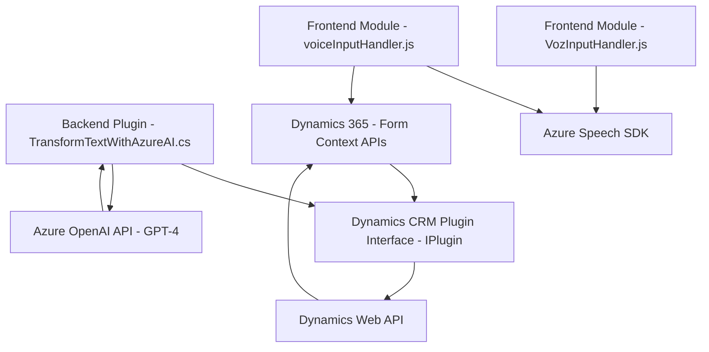

Based on the repository structure and provided descriptions, here's the detailed analysis:

---

### **Breve resumen técnico**
The repository appears to implement a solution based on Microsoft Dynamics CRM extending its functionality through frontend JavaScript files, plugins, and external integrations. It includes voice input and text-to-speech capabilities powered by Azure Speech SDK, along with advanced text formatting via Azure OpenAI services using GPT. These components aim to enhance user interaction with forms through AI-driven voice processing and text transformation.

---

### **Descripción de arquitectura**
The solution utilizes a **mixed architecture** combining client-side front-end processing and backend plugins for Dynamics CRM. 
1. The **frontend** JavaScript files execute client-heavy, event-driven interactions with the Dynamics 365 form's context using APIs from the DOM, Xrm SDK, and Azure Speech SDK.
2. The backend plugin (`TransformTextWithAzureAI.cs`) integrates with Dynamics CRM workflows to offload complex text processing tasks to Azure OpenAI, adhering to the principles of event-driven design and external service integration.

The approach leans towards **modular architecture**:
- Clearly segregated logic between front-end and back-end components.
- Frontend follows a simplified **2-layer architecture** (presentation & logic).
- The plugin design adheres to the **plug-and-play structure** typical of Microsoft Dynamics CRM, enabling modular workflows.

---

### **Tecnologías usadas**
1. **Frontend:**
   - **Azure Speech SDK** for voice recognition and synthesis.
   - **Dynamics CRM APIs (Xrm.WebApi)** to interact with form data and backend CRM entities.
   - **Standard JavaScript** with modern principles like modularization and async/await for async processes.
   - DOM manipulation for dynamic behavior and integration.
2. **Backend:**
   - Microsoft Dynamics CRM SDK (`IPlugin`) for workflow extensions.
   - Azure OpenAI (`GPT-4 standard deployment`) for text transformation.
   - .NET framework for plugin execution and REST API integration.
   - Libraries like `System.Text.Json` for JSON serialization/deserialization and `Newtonsoft.Json.Linq` for advanced JSON manipulation.

---

### **Diagrama Mermaid**

---

### **Conclusión final**
This repository represents an innovative, modular solution that enhances Microsoft Dynamics CRM with cutting-edge functionality from a combination of Azure services (Speech SDK and OpenAI) and standard CRM backend plugins. It facilitates fluid voice-based user interactions directly within forms and employs AI-based text processing to improve the quality and structure of CRM data. The architecture is optimized for scalability, allowing seamless integration into existing Dynamics workflows. However, a potential area for improvement is building a robust error-handling mechanism in the plugin for better fault tolerance when relying on external APIs.