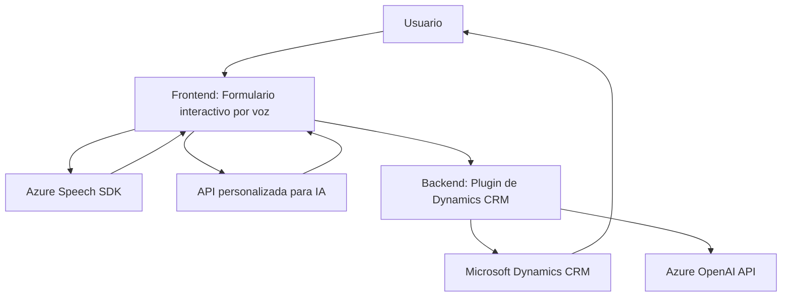

### **Breve Resumen Técnico**
El repositorio parece ser parte de una solución para automatización de interacción con formularios en un sistema como Microsoft Dynamics CRM. La solución permite la interacción entre usuarios y formularios por medio de comandos de voz, textos hablados y transformación de datos utilizando servicios de Azure (Azure Speech SDK y Azure OpenAI).

---

### **Descripción de la Arquitectura**
La solución integra tres componentes principales:
1. **Frontend:** Encargado de la interacción con el usuario final. Esta capa incluye mecanismos para convertir datos del formulario en texto hablado (usando Azure Speech SDK) y para procesar comandos de voz.
2. **Backend (Plugins):** Implementado como un plugin de Dynamics CRM, procesando texto y aplicando transformaciones por medio de Azure OpenAI.
3. **Servicios externos:** La solución depende de servicios en la nube, Azure Speech SDK para síntesis y reconocimiento de voz y Azure OpenAI para procesamiento de textos y generación de JSON.

La arquitectura general sigue un modelo **servicio desacoplado con integración API**, destacándose por integrar componentes de diferentes capas:
- Frontend: Comunicación directa con usuarios y APIs de Azure.
- Plugin Backend: Extensión personalizada para Microsoft Dynamics CRM.
- Servicios externos: APIs de Azure para procesamiento de voz y texto.

---

### **Tecnologías Utilizadas**
#### **Frontend (Javascript)**
1. **Azure Speech SDK:** Para realizar la síntesis y reconocimiento de voz en tiempo real.
2. **JavaScript:** Lenguaje de programación principal para la implementación de funcionalidades como manipulación del DOM, extracción de datos y comunicación con SDK y APIs externas.
3. **API externa personalizada:** Para procesamiento adicional si se activa un modo avanzado que utiliza inteligencia artificial.

#### **Backend (Plugin en C# para Dynamics CRM)**
1. **C# .NET Framework:**
   - **Microsoft.Xrm.Sdk:** Para manipulación del modelo de datos y ejecución de servicios en Dynamics CRM.
   - **System.Text.Json y Newtonsoft.Json:** Para manipulación del texto JSON.
   - **System.Net.Http:** Para comunicación con el endpoint de Azure OpenAI.
2. **Azure OpenAI API:** Para enviar prompts y procesar inteligencia artificial en formato JSON.

---

### **Patrones Utilizados**
1. **Encapsulación de funciones:** Todas las operaciones están divididas en funciones específicas según el objetivo: síntesis de voz, transcripción, validación de datos y mapeo de atributos en entornos de formularios.
2. **Event-driven architecture:** El código utiliza eventos disparados (iniciadores como clics en el frontend o triggers en el backend CRM plugin) para iniciar el procesamiento.
3. **Service-oriented architecture:** Conecta componentes de la solución mediante servicios externos (Azure Speech, OpenAI API) y la API Web CRM personalizada.
4. **Dynamic modular load:** En el frontend, los scripts del SDK se cargan dinámicamente solo cuando son necesarios (esto mejora la eficiencia del proceso).

---

### **Diagrama Mermaid**

---

### **Conclusión Final**
La solución presentada combina tecnologías modernas (Azure SDKs y OpenAI Service) con una clara orientación hacia la potenciación de la interacción humano-computadora mediante voz y AI. La arquitectura del sistema sigue una estructura modular que integra distintas capas (Frontend y Backend) con servicios externos, por lo que puede clasificarse como una **arquitectura de servicios desacoplados**. Aunque el diseño modular y orientado a eventos resulta beneficioso, algunos aspectos como el manejo de las credenciales y valores sensibles podrían mejorarse usando prácticas más seguras (como variables de entorno o servicios de gestión de secretos). Además, la conexión con múltiples APIs marca un claro enfoque hacia la integración de plataformas de terceros.