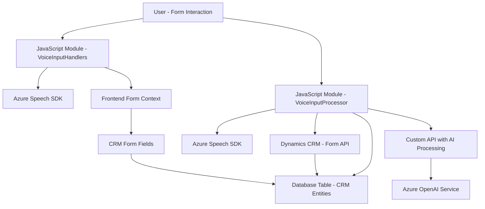

### Breve resumen técnico
La estructura presentada parece ser un proyecto que engloba interacción con formularios web en un sistema CRM (Dynamics CRM), utilizando **Azure Speech SDK** para sintetizar voz y reconocimiento de audio. Además, incluye un módulo de plugin basado en C# que utiliza el servicio **Azure OpenAI** para transformar datos dentro del contexto CRM. La solución parece orientada a la automatización de entrada/salida de voz y procesamiento de texto con IA.

---

### Descripción de arquitectura
La arquitectura tiene componentes independientes integrados en un ecosistema mayor, Dynamics CRM. La interacción se canaliza a través de plugins y módulos JavaScript que colaboran para procesar datos (formulario, texto hablado) y delegarlos a servicios externos. La arquitectura sigue patrones de capas:
- **Presentación:** Los formularios interactivos y scripts de JavaScript que manejan UI/UX.
- **Lógica de negocio:** Implementada en Javascript (VoiceInputProcessor.js) y en el plugin C# (TransformTextWithAzureAI.cs).
- **Acceso a datos:** Dependencia directa de **Dynamics CRM API** y Azure Services (Speech SDK y OpenAI).

La solución tiene características de **n capas**, donde:
1. **Front-end (JavaScript):** Gestiona interacción con usuarios (voz, texto).
2. **Servicio externo (Azure Speech SDK / OpenAI):** Procesamiento de texto y síntesis de voz.
3. **Back-end (Dynamics Plugin):** Procesa y transforma contenido en el ecosistema CRM.

---

### Tecnologías usadas
1. **Frontend:**
   - **Dynamics Web Resources:** Extiende CRM con módulos y herramientas dinámicas para interactuar con datos.
   - **JavaScript ES6.**
   - **Azure Speech SDK:** Reconocimiento/registro de habla y síntesis de voz.

2. **Backend:**
   - **Microsoft Dynamics CRM:** Base CRM.
   - **Azure OpenAI Service:** Procesa datos y transforma texto con IA.
   - **C# y .NET Framework:** Desarrollo del plugin.
   - **Newtonsoft.Json:** Procesamiento de JSON.

3. **Networking:**
   - **HTTP** para peticiones a servicios Azure (OpenAI, Speech SDK).
   - **REST API de Dynamics CRM** (`Xrm.WebApi`) para CRUD de entidades.

---

### Diagrama Mermaid válido para GitHub Markdown

---

### Conclusión final
Esta solución es una extensión personalizada en el ecosistema Dynamics CRM, complementada con tecnologías Azure para entrada de audio y procesamiento de texto. La arquitectura sigue el patrón **n capas**, con separación clara entre presentación, lógica de negocio y acceso a datos. Las tecnologías internas y externas colaboran efectivamente para ofrecer funcionalidades avanzadas de interacción voz-texto y automatización mediante inteligencia artificial.