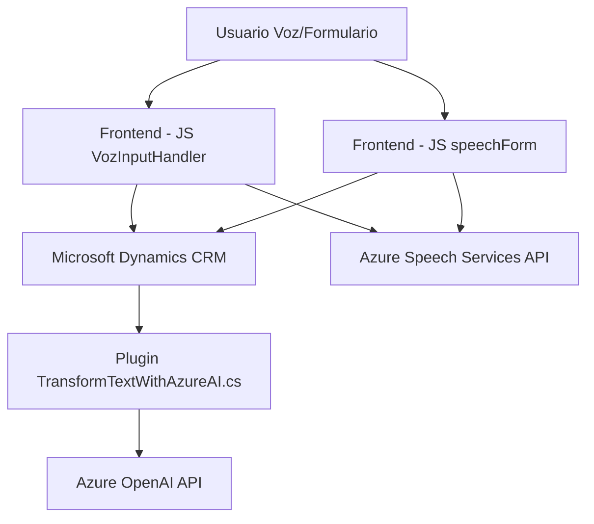

### Breve resumen técnico
La solución representa un sistema modular con funcionalidades relacionadas con la interacción de formularios utilizando reconocimiento y síntesis de voz, conectado con servicios externos como **Azure Speech SDK** y **Azure OpenAI GPT**. Además, se integra con Microsoft Dynamics CRM para modificar datos del formulario con comandos hablados y procesados. También se incluye un plugin para procesamiento de texto mediante IA.

---

### Descripción de arquitectura
La solución está organizada en tres componentes principales:
1. **Frontend**:
   - Maneja formularios en un entorno CRM.
   - Proporciona funcionalidades de entrada, salida y procesamiento de datos mediante reconocimiento y síntesis de voz.
2. **Backend (Plugin)**:
   - Implementa un **plugin para Microsoft Dynamics CRM** en C#, que procesa texto mediante **Azure OpenAI** y devuelve un JSON estructurado.
   - Actúa como middleware entre el CRM y el servicio de IA.
3. **Dependencias externas**:
   - Uso de **Azure Speech SDK** para reconocimiento y síntesis de voz.
   - Uso de **Azure OpenAI GPT API** para generación de texto estructurado basado en comandos.

La arquitectura puede clasificarse como **modular y basada en servicios**, donde los módulos se comunican con servicios externos para ejecutar las tareas específicas de interacción por voz y procesamiento de texto. La comunicación entre frontend CRM, plugins y Azure APIs sigue un patrón basado en eventos y dependencias externas.

---

### Tecnologías usadas
1. **Frontend**:
   - **JavaScript** para la interacción con formularios y control de SDK.
   - **Azure Speech SDK** para servicios de síntesis y reconocimiento de voz.
   - **Pattern loader** para carga dinámica del SDK.
   - **Microsoft Dynamics CRM API** para manipulación de formularios.
2. **Backend (C# Plugin)**:
   - **C#** desarrollado como un plugin para Dynamics CRM.
   - **Microsoft Xrm SDK** para la interacción con datos del CRM.
   - **Azure OpenAI GPT API** para generación de texto estructurado.

### Dependencias o componentes externos
1. **Azure Speech Services API**: Para la funcionalidad de síntesis y reconocimiento de voz en el cliente frontend.
2. **Microsoft Dynamics CRM**: API interna para formularios CRM y datos relacionados con procesos de negocio.
3. **Azure OpenAI GPT API**: Para procesamiento avanzado de texto basado en IA.
4. **System.Net.Http**: Para comunicación REST en el plugin.
5. **Newtonsoft.JSON** y **System.Text.Json**: Para manipulación y serialización de datos en el backend.

---

### Diagrama Mermaid 100% compatible con GitHub Markdown

---

### Conclusión final
La solución implementa un sistema para interacción por voz que se integra en un entorno CRM, con módulos frontend que gestionan la síntesis y reconocimiento de voz y un backend (plugin) encargado de procesar texto mediante IA. La arquitectura modular y el uso de dependencias externas permiten escalar funcionalidades basadas en servicios. Sin embargo, el impacto en rendimiento y la dependencia de servicios externos deben evaluarse cuidadosamente para garantizar disponibilidad y consistencia en la solución. Los patrones de diseño, como modularidad basada en tareas y comandos por eventos, hacen que este sistema sea adecuado para integraciones con Microsoft Dynamics CRM y soluciones de voz avanzadas.